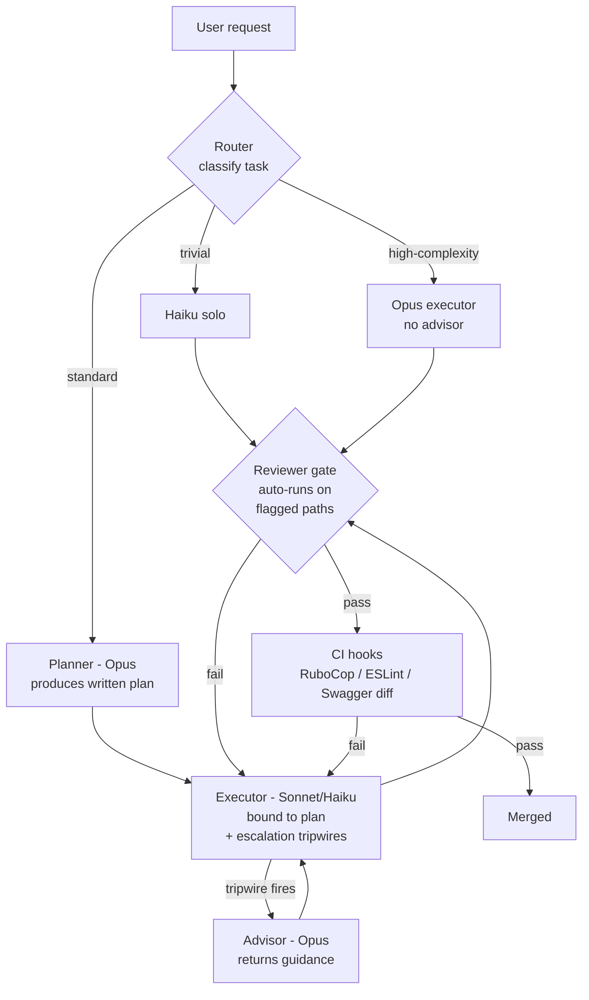
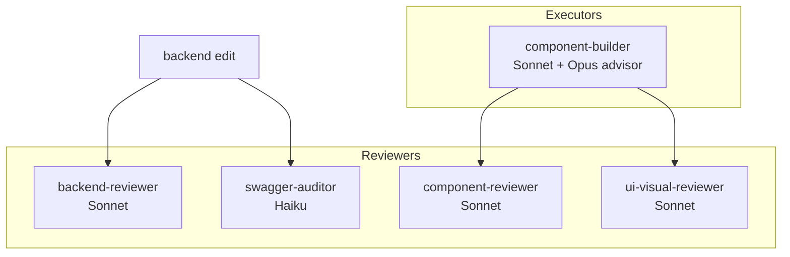
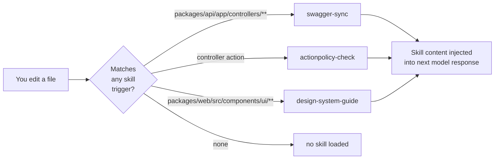
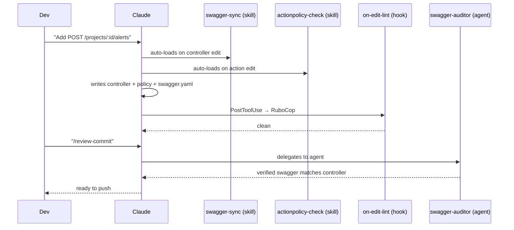
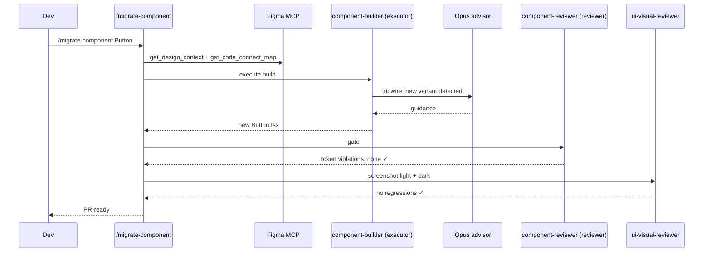
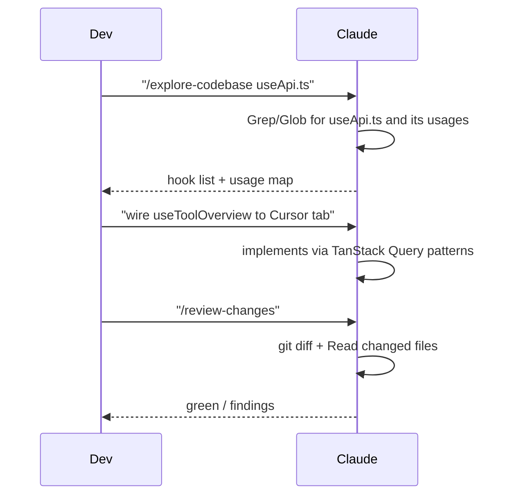

# AGENTS.md — Claude tooling guide for DB90

Welcome! This doc explains the Claude tooling you have access to in this project: commands you can type, agents the model can spawn, skills that auto-load when you're editing certain files, and hooks that run automation for you.

> Use Grep, Glob, and Read to explore the codebase. For directed searches use those tools directly. For broader exploration use the Explore subagent.

**Who this is for:** every engineer on DB90, whether day-one or day-1000. The tooling teaches itself — if you forget how something works, just ask.

**Quick start:** run `/onboard` in Claude Code for a guided 10-minute walkthrough, or `/help-tooling` anytime to see a live catalog of what's available.

For conventions the tooling *enforces* (Alba, ActionPolicy, Swagger sync, etc.), see [CLAUDE.md](CLAUDE.md).

## TL;DR

| Primitive | Invoked by | Use for | File location |
|---|---|---|---|
| **Command** | You type `/name` | Explicit workflows you run on demand | `.claude/commands/*.md` |
| **Agent** | Model spawns via Task tool, or you `@agent-name` | Isolated deep work, specialist reviews | `.claude/agents/*.md` |
| **Skill** | Model auto-triggers on matching context | Domain knowledge pulled in silently | `.claude/skills/<name>/SKILL.md` |
| **Hook** | Harness runs on Claude events | Automation outside the model (lint, tests) | `.claude/hooks/*.ts` via `settings.json` |

Works identically in Claude Code CLI (terminal) and in Agent SDK sessions. Same folder, same schema.

---

## Architecture overview



### Why this shape

Anthropic's Advisor Strategy (Sonnet executor + Opus advisor) promises Opus quality at Sonnet cost. Real-world testing showed a failure mode: **the executor cannot reliably self-identify when to escalate.** We address that with five layers of defense rather than trusting the executor alone.

> **Note:** The Router and Planner boxes in this diagram are **aspirational**. Current implementation relies on hard-coded tripwires in executor agents + reviewer/auditor gates + CI hooks. The Router is manual today — the engineer chooses the right command. The Planner is the "call advisor before starting" step in the executor timing block, not a separate agent.

---

## Folder layout

```
.claude/
├── agents/
│   ├── backend-reviewer.md       # reviewer — Alba/ActionPolicy/layering
│   ├── component-builder.md      # executor — Figma-driven UI build
│   ├── component-reviewer.md     # reviewer — token/a11y gate
│   ├── swagger-auditor.md        # auditor — swagger-sync compliance
│   └── ui-visual-reviewer.md     # reviewer — screenshot regression
├── commands/
│   ├── debug-issue.md
│   ├── discover-skills.md        # scan project stack → install skills from skills.sh
│   ├── explore-codebase.md
│   ├── help-tooling.md
│   ├── implement-design.md       # Figma URL → production code (7-step MCP workflow)
│   ├── manage-worktrees.md
│   ├── migrate-component.md      # orchestrated component migration
│   ├── onboard.md
│   ├── playwright-best-practices.md  # E2E/component/auth/CI patterns reference
│   ├── playwright-cli.md         # 40+ CLI commands reference
│   ├── postgresql-optimization.md    # EXPLAIN ANALYZE, indexes, window functions
│   ├── postgresql-table-design.md    # schema design, partitioning, TimescaleDB
│   ├── refactor-plan.md
│   ├── review-architecture.md
│   ├── review-changes.md
│   ├── review-commit.md
│   ├── tailwind-v4-shadcn.md     # v4 setup, migration pitfalls, shadcn/Radix
│   ├── tanstack-query-best-practices.md  # 32 TanStack Query v5 rules
│   └── typescript-react-reviewer.md  # React 19 + TS review: bugs, anti-patterns
├── skills/
│   ├── actionpolicy-check/SKILL.md  # auto-triggered — controller actions
│   ├── design-system-guide/SKILL.md # auto-triggered — components/ui/**
│   └── swagger-sync/SKILL.md        # auto-triggered — controllers/routes
├── hooks/
│   ├── on-edit-lint.ts           # PostToolUse: ESLint/RuboCop on edited file + Haiku banner (Node.js, cross-platform)
│   └── model-indicator.ts        # PreToolUse(Agent): colored model banner (Opus=red, Sonnet=orange, Haiku=green)
├── scripts/
│   ├── risk-score.ts             # Deterministic risk scorer — tier + callers + churn + spec → JSON
│   └── convention-check.ts       # Branch name + commit message format checker (Haiku task)
├── settings.json                 # committed, portable (DB90_COACHING=true default)
└── settings.local.json           # gitignored, per-dev overrides
```

---

## Primitives in detail

### Commands — things you type (`/name`)

Type `/` in Claude Code to see them all autocomplete. Not sure which to use? Just ask — any command or agent can explain itself if you say "how does this work?"

| Command | When to use | Who it calls |
|---|---|---|
| `/help-tooling` | *"What's available and when do I use what?"* | — (meta) |
| `/onboard` | *"I'm new, walk me through this"* | — (guided) |
| `/review-architecture` | Before a big PR — deep architectural review | Reviewer agents |
| `/review-commit` | Pre-push sanity check | Reviewer agents |
| `/review-changes` | Risk-scored review: runs `risk-score.ts` (tier + callers + churn + spec) → escalates HIGH/CRITICAL to Opus advisor | Reviewer agents |
| `/debug-issue` | Hunting a specific bug | — |
| `/explore-codebase` | Onboarding to an unfamiliar area | — |
| `/refactor-plan` | Planning a rename/extract before you touch code | — |
| `/migrate-component` | Migrating one component to new design system | component-builder + component-reviewer + ui-visual-reviewer |
| `/manage-worktrees` | Creating/opening/cleaning worktrees | — |
| `/discover-skills` | Scan project stack and install relevant skills from skills.sh safely | — (self-contained) |
| `/implement-design` | Implement a Figma node URL into code — 7-step MCP workflow | Figma MCP |
| `/playwright-best-practices` | Playwright patterns reference — E2E, auth, debugging, CI/CD | — |
| `/playwright-cli` | Browser automation CLI command reference | — |
| `/postgresql-table-design` | Schema design — data types, indexing, partitioning, TimescaleDB | — |
| `/postgresql-optimization` | Query optimization — EXPLAIN ANALYZE, indexes, window functions | — |
| `/tanstack-query-best-practices` | TanStack Query v5 rules — keys, caching, mutations, error handling | — |
| `/tailwind-v4-shadcn` | Tailwind v4 setup, migration pitfalls, shadcn/Radix integration | — |
| `/typescript-react-reviewer` | React 19 + TS code review — bugs, anti-patterns, strict config | — |

### Agents — model invokes (specialists, isolated context)

Every agent is either an **executor** (does work) or a **reviewer** (gates work). Never both.



| Agent | Role | Scope | Model |
|---|---|---|---|
| `backend-reviewer` | Reviewer | Backend diff — enforces Alba, ActionPolicy, layered architecture | Sonnet |
| `swagger-auditor` | Auditor (hard gate) | Controller diff + swagger.yaml diff | Haiku |
| `component-builder` | Executor | Figma node → shadcn/Radix component | Sonnet + Opus advisor |
| `component-reviewer` | Reviewer | Token usage, dark mode, a11y | Sonnet |
| `ui-visual-reviewer` | Reviewer | Screenshots in both themes, visual regression | Sonnet |

### Skills — auto-triggered (silent domain knowledge)



### Hooks — harness automation (silent enforcement)

Triggered by Claude Code events, not the model. Run shell commands; output is visible to Claude but side effects (e.g. RuboCop auto-correct) apply immediately.

- `PostToolUse` on `Edit|Write` → `on-edit-lint.ts` runs ESLint/RuboCop on just the edited file and prints a **green Haiku banner** to stderr so you can see the lightweight executor is active (Node.js, cross-platform — works on Windows, macOS, and Linux).
- `PreToolUse` on `Agent` → `model-indicator.ts` prints a colored model banner before every agent spawn: **red = Opus advisor**, **orange = Sonnet executor**, **green = Haiku executor**. Makes model switches visible directly in the Claude Code execution steps.
- Pre-approved Bash permissions remove prompt fatigue for safe commands.

---

## Example flows

### Adding a new API endpoint



### Migrating a design-system component



### Wiring a mocked UI to a real endpoint



---

## When to use what — decision tree

```mermaid
flowchart TD
    start[I want to...] --> q1{Explicit workflow\nI run on demand?}
    q1 -->|yes| cmd[Use a /command]
    q1 -->|no| q2{Should Claude pull\nin knowledge\nautomatically?}
    q2 -->|yes| skill[Write a skill]
    q2 -->|no| q3{Need isolated\ndeep work\nor specialist?}
    q3 -->|yes| agent[Write an agent]
    q3 -->|no| q4{Outside-the-model\nautomation?\n(lint, CI, format)}
    q4 -->|yes| hook[Write a hook]
    q4 -->|no| docs[Document in CLAUDE.md]
```

---

## Advisor pattern — Claude Code

The executor/advisor pattern in this repo is implemented entirely within Claude Code tooling (no API-layer advisor tool needed):

- **Executor agents** (Sonnet) do the work with hard-coded tripwires that force a reviewer call at decision points.
- **Reviewer/auditor agents** act as the advisor — they return findings and pass/fail verdicts, not code.
- **Model pairing**: executors use `claude-sonnet-4-6`; complex decisions escalate to `claude-opus-4-6` (or the latest stable Opus) via the Task tool.

The timing block every executor follows: call reviewer/advisor **before** substantive work, **when stuck**, **when changing approach**, and **before declaring done**. Never silently switch when evidence conflicts — surface the conflict via another call.

| Executor | When to escalate to Opus |
|---|---|
| `component-builder` | Any of the 5 hard-coded tripwires fires |
| Other executors | When task complexity exceeds routine work |

## UI tooling stack

For any UI-related work, use this combo:

| Tool | When | Why |
|---|---|---|
| **Figma Desktop MCP** | Build time — source of truth | Full API: code connect, variables, screenshots |
| **Claude_Preview** | Build time — inline render check | Fast feedback loop |
| **Playwright** | Review + CI — visual regression | Deterministic, headless, PR gate |
| **Claude_in_Chrome** | Manual investigation only | Stateful flows, auth-required pages |
| **Figma Web MCP** | Fallback only | Desktop unavailable |

Never use Claude_in_Chrome as the enforcement layer — it's non-deterministic and needs a user's open window. Enforcement lives in Playwright.

---

## Setup — for new engineers

### One-time machine setup (5 minutes)

```bash
# 1. Clone and install
git clone git@github.com:dualboot-partners/db90-rails.git
cd db90-rails
make up            # Start Docker services
make api &         # Run Rails in background
make web &         # Run Vite in background

# 2. Verify Claude Code sees the tooling (in Claude Code CLI)
# Open the repo in a new terminal:
claude
# Type: /
# You should see all commands listed under /

# 3. Verify hook works
# Inside Claude: ask to edit any .rb file
# You should see RuboCop output appear after the edit

# 4. Set up personal overrides (optional — experienced devs turn off coaching)
cp .claude/settings.local.json.example .claude/settings.local.json
# Edit to set DB90_COACHING=false or add your personal permissions
```

### Figma MCP setup (for UI work)

1. Open Figma Desktop.
2. Open the DB90 design system file (ask lead for link).
3. In Claude Code, the Figma MCP is auto-detected when Desktop is running. Verify with: "list Figma libraries".

### Playwright visual regression setup (first time)

```bash
cd packages/web
npx playwright install chromium
```

`ui-visual-reviewer` will use Playwright to verify visual accuracy and feature behavior when invoked. Baseline snapshot storage and historical diff artifacts are out of scope for now — the reviewer verifies current state only.

### Worktree setup (for parallel tickets)

```bash
# In the main repo
claude
# Inside Claude:
/manage-worktrees create a worktree for AIX-XX
# Then open a new terminal at the worktree path and run `claude` there.
```

---

## How to work — common workflows

### A. Add a new API endpoint

1. In Claude: "Add `GET /organizations/:id/alerts`."
2. Claude auto-loads the `swagger-sync` skill when you edit a controller, and `actionpolicy-check` when you edit an action.
3. Claude writes controller + policy + `swagger.yaml` + spec.
4. `on-edit-lint` hook runs RuboCop automatically — fix anything it flags.
5. Run `make test-api` to confirm specs pass.
6. Invoke `/review-commit` before pushing — spawns `swagger-auditor` and `backend-reviewer`.
7. Push. CI runs full RuboCop + Brakeman + RSpec.

### B. Migrate a design-system component from new Figma

1. Make sure Figma Desktop is open on the component's page.
2. In Claude: `/migrate-component Button`
3. The command orchestrates: Figma pull → impl diff → consumer list → `component-builder` → `component-reviewer` → `ui-visual-reviewer`.
4. Review the diff and visual review findings.
5. Commit and open PR.

### C. Wire a mocked UI to a real endpoint

1. `/explore-codebase` to find the existing hook.
2. In Claude: "Wire the Cursor tab to use `useToolOverview` instead of mock data."
3. Claude edits the page; TanStack Query handles fetching.
4. `on-edit-lint` hook runs ESLint automatically.
5. Manually verify in browser at `http://localhost:5173`.
6. `/review-changes` before pushing — risk-scored review (runs `risk-score.ts`, escalates to Opus if HIGH/CRITICAL).

### D. Debug a bug

1. `/debug-issue` — systematic trace using native search tools.
2. Greps for symbols → traces call sites → checks recent commits to see if a recent edit caused it.
3. Reports root cause with specific file:line refs.

### E. Plan a refactor before touching anything

1. `/refactor-plan` — previews blast radius before any code changes.
2. Greps for all usages to list all affected locations.
3. Review the plan, then explicitly ask Claude to apply it.

### F. Pre-PR architecture review

1. `/review-architecture` — deep dive on maintainability, security, performance.
2. `/review-changes` — risk-scored review (runs `risk-score.ts`, escalates to Opus if HIGH/CRITICAL).
3. `/review-commit` — lint + test context.
4. All three together before a non-trivial PR.

---

## Portability

- `settings.json` uses `${CLAUDE_PROJECT_DIR}` and `${env:VAR}` — never hardcoded absolute paths.
- Hook scripts live in-repo at `.claude/hooks/*.ts` — Node.js, cross-platform (Windows, macOS, Linux), no shell dependency. Invoked via `node --experimental-strip-types` (Node.js 22+ required, already pinned in `.tool-versions`).
- Per-machine overrides belong in `.claude/settings.local.json` (gitignored).

After `git pull`, every contributor gets commands + agents + skills + hooks with zero setup. Playwright needs one-time `npx playwright install chromium`.

---

## Learning as you work — the tutor layer

Every primitive in `.claude/` is **self-teaching**. You never need to memorize anything.

### Three ways to learn

**1. Ask the primitive directly.**
```
"How does swagger-auditor work?"
"When should I use /refactor-plan vs /review-changes?"
"What does the actionpolicy-check skill actually do?"
```
Any agent/skill/command switches to Tutor Mode and explains itself in under 200 words.

**2. Use `/help-tooling`.**
A live catalog generated from `.claude/` — never out of date. Filter by topic:
```
/help-tooling design system
/help-tooling backend
/help-tooling review
```

**3. Use `/onboard` once.**
A 10-minute guided walkthrough for new engineers. Run it again anytime as a refresher.

### Coaching trailers (default on)

By default, non-trivial commands end with a one-line trailer explaining *why* that path was taken:

> *(You saw the swagger-sync skill fire because you edited a controller. Run `/help-tooling swagger-sync` for more.)*

**Experienced devs can turn these off** by setting `"DB90_COACHING": "false"` in `.claude/settings.local.json`.

---

## A few principles

- **Defaults prefer safety over speed.** Coaching is on, reviewers run by default, CI hooks enforce what skills only suggest.
- **Nothing is enforced only at the model layer.** Every convention also has a backstop (RuboCop, ESLint, CI, or a reviewer agent).
- **Portable by construction.** `${CLAUDE_PROJECT_DIR}` and env vars — no `/Users/yourname/...` leaks.
- **Discoverable by construction.** The tooling teaches itself; no separate docs to maintain.
- **Rename is rare; deprecation is loud.** If we rename a command, the commit message flags it and this doc is updated same-PR.

---

## Codebase Exploration

Use Grep, Glob, and Read to explore the codebase. For directed searches (a known file, class, or function) use those tools directly. For broader open-ended exploration, use the Explore subagent.
