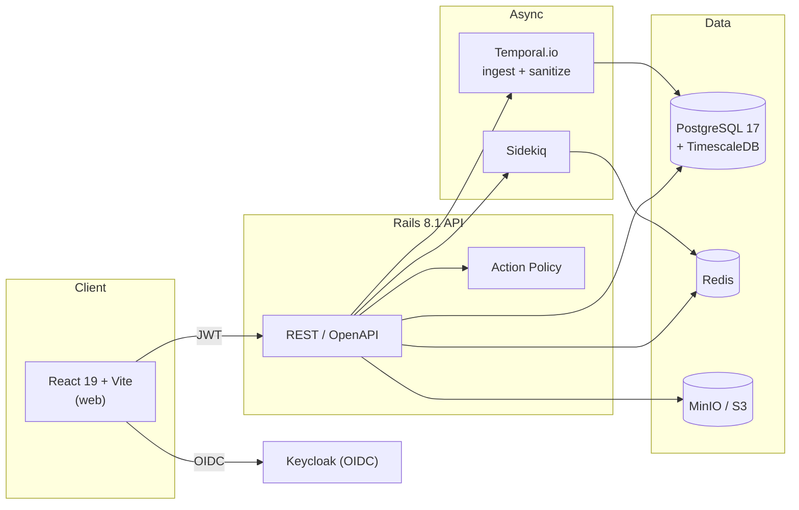

# Aixle Insights

[](LICENSE)
[](.tool-versions)
[](packages/api)
[](packages/web)
[](packages/web)
[](CONTRIBUTING.md)

AI tool analytics platform for tracking and managing coding assistant usage across organizations. Monitors tools like ChatGPT, Claude, GitHub Copilot, and others — capturing token consumption, costs, and usage patterns with built-in risk scanning and data retention policies.

## Quickstart

```bash
git clone https://github.com/dualboot-partners/aixle-insights.git
cd aixle-insights
make setup          # build, start services, create + migrate + seed DB
make api & make web # Rails on :3000, Vite on :5173
```

Then open [localhost:5173](http://localhost:5173) and sign in via Keycloak. Full
step-by-step setup is in [Getting Started](#getting-started).

## Table of Contents

- [Features](#features)
- [Architecture](#architecture)
- [Prerequisites](#prerequisites)
- [Getting Started](#getting-started)
- [Auth](#auth)
- [Integrations](#integrations)
- [Makefile Reference](#makefile-reference)
- [Testing](#testing)
- [Ports](#ports)
- [Contributing](#contributing)
- [Security](#security)
- [License](#license)

## Features

- **Multi-tool telemetry** — track usage across ChatGPT, Claude, GitHub Copilot, Cursor, and more from one place.
- **Cost & token analytics** — per-user, per-team, and per-organization breakdowns of tokens and spend over time.
- **Risk scanning** — a versioned sanitization pipeline flags and redacts sensitive content before it is persisted.
- **Data retention policies** — configurable retention backed by TimescaleDB hypertables and automated policies.
- **Broad integrations** — GitHub, GitLab, Bitbucket, Jira, Linear, and direct AI-provider keys (Anthropic, OpenAI, OpenRouter, Gemini).
- **Enterprise auth** — Keycloak (OIDC) with optional Google social login.
- **Durable workflows** — Temporal.io orchestrates ingestion and sanitization with retries and state.

## Architecture



```
aixle-insights/
├── packages/
│   ├── api/          # Rails 8.1 API (port 3000)
│   └── web/          # React + Vite frontend (port 5173)
├── temporal/         # Temporal.io workflow workers
├── keycloak/         # Realm config & custom themes
└── docker-compose.yml
```

| Layer | Stack |
|-------|-------|
| Frontend | React 19, Vite 7, TypeScript, Tailwind CSS 4, shadcn/ui, TanStack Query |
| Backend | Rails 8.1 (API-only), Alba serializers, Action Policy |
| Database | PostgreSQL 17 + TimescaleDB (time-series hypertables) |
| Auth | Keycloak (OIDC) with optional Google social login |
| Workflows | Temporal.io (Ruby SDK) for ingestion/sanitization pipelines |
| Storage | MinIO (S3-compatible), Redis |

## Prerequisites

- **Ruby** 3.4.8 and **Node.js** 24.13.0 (see `.tool-versions` — [asdf](https://asdf-vm.com) recommended)
- **Docker** and Docker Compose
- **Bundler** (`gem install bundler`)

## Getting Started

### 1. Start infrastructure

```bash
make up
```

This launches all Docker services:

| Service | URL |
|---------|-----|
| PostgreSQL (TimescaleDB) | `localhost:5432` |
| Redis | `localhost:6379` |
| Keycloak | [localhost:8080](http://localhost:8080) (admin/admin) |
| Temporal | `localhost:7233` |
| Temporal UI | [localhost:8088](http://localhost:8088) |
| MinIO | [localhost:9000](http://localhost:9000) (console: [9001](http://localhost:9001)) |

> **Note:** The default credentials in `docker-compose.yml` (Postgres `postgres`, MinIO `minioadmin`, Keycloak `admin`) are for **local development only**. Never reuse them in staging or production — override every secret via environment variables before deploying.

### 2. Install dependencies

```bash
cd packages/api && bundle install
cd ../web && npm install
cd ../../temporal && bundle install
```

### 3. Set up the database

```bash
make db-create
make db-migrate
make db-seed        # loads ~100 simulated engineers over 45 days
```

### 4. Configure environment

Copy the example env files and fill in values as needed:

```bash
cp .env.example .env                       # Google OAuth credentials (optional)
cp packages/web/.env.example packages/web/.env
```

The web defaults work out of the box for local development:

```
VITE_API_URL=/api/v1
VITE_KEYCLOAK_URL=http://localhost:8080
VITE_KEYCLOAK_REALM=db90
VITE_KEYCLOAK_CLIENT_ID=db90-web
```

### 5. Run the app

In separate terminals:

```bash
make api      # Rails at http://localhost:3000
make web      # Vite at http://localhost:5173
make worker   # Temporal worker (optional)
```

Open [localhost:5173](http://localhost:5173) and log in via Keycloak.

### Automated setup

Alternatively, `make setup` (or `./scripts/setup.sh`) runs steps 2–4 in one shot.

## Auth

Keycloak manages authentication via OpenID Connect. The frontend uses `oidc-client-ts` to handle the OAuth code flow, and the Rails API validates JWTs on every request.

- **Realm**: `db90`
- **Client**: `db90-web` (public)
- **Admin console**: [localhost:8080](http://localhost:8080) — username `admin`, password `admin`
- **Google login**: Optional — set `GOOGLE_CLIENT_ID` and `GOOGLE_CLIENT_SECRET` in `.env`

### Setting up Google login locally

Google OAuth goes through Keycloak as an identity broker — Google never redirects back to your frontend or Rails API directly.

1. Go to [Google Cloud Console → APIs & Credentials](https://console.cloud.google.com/apis/credentials)
2. Create or edit an **OAuth 2.0 Client ID**
3. Under **Authorized redirect URIs**, add **only** this URL:
   ```
   http://localhost:8080/realms/db90/broker/google-dbp/endpoint
   ```
4. Copy the **Client ID** and **Client Secret** into your `.env`:
   ```env
   GOOGLE_CLIENT_ID=your-client-id
   GOOGLE_CLIENT_SECRET=your-client-secret
   ```
5. Restart the containers: `docker compose up -d`

## Integrations

Each integration uses either an OAuth app (code hosting / project management) or a plain API key (AI providers). Credentials are passed to the Rails API via environment variables — add them to your `.env` file and `docker-compose.yml` under the `api` service's `environment:` block, then restart the container.

```bash
docker compose up -d api
```

<details>
<summary><b>Integration setup — GitHub, GitLab, Bitbucket, Jira, Linear, Anthropic, OpenAI, OpenRouter, Gemini</b></summary>

---

### GitHub

1. Go to **Settings → Developer settings → OAuth Apps → New OAuth App**
2. Set **Authorization callback URL** to `http://localhost:5173/integrations/callback`
3. Copy the **Client ID** and generate a **Client Secret**

```env
GITHUB_CLIENT_ID=your-client-id
GITHUB_CLIENT_SECRET=your-client-secret
```

`docker-compose.yml` → `api.environment`:
```yaml
GITHUB_CLIENT_ID: "${GITHUB_CLIENT_ID}"
GITHUB_CLIENT_SECRET: "${GITHUB_CLIENT_SECRET}"
```

---

### GitLab

1. Go to **Preferences → Applications → Add new application** (or use a [Group](https://gitlab.com/groups) application for shared access)
2. Set **Redirect URI** to `http://localhost:5173/integrations/callback`
3. Enable scopes: `read_user`, `read_api`, `read_repository`
4. Copy the **Application ID** and **Secret**

```env
GITLAB_CLIENT_ID=your-application-id
GITLAB_CLIENT_SECRET=your-secret
```

`docker-compose.yml` → `api.environment`:
```yaml
GITLAB_CLIENT_ID: "${GITLAB_CLIENT_ID}"
GITLAB_CLIENT_SECRET: "${GITLAB_CLIENT_SECRET}"
```

---

### Bitbucket

> **Note:** Bitbucket OAuth consumers are workspace-level

1. Log into [Bitbucket.org](https://bitbucket.org)
2. Select your **Workspace** (bottom-left corner)
3. Click **Settings** (gear icon) on the left sidebar
4. Under **Apps and Features**, click **OAuth consumers**
5. Click **Add consumer**
6. Set **Callback URL** to `http://localhost:5173/integrations/callback`
7. Enable the following permissions:

| Scope | Permission | Purpose |
|---|---|---|
| Account | Read | Retrieve user identity (email/profile) |
| Repositories | Read | Access repository metadata |
| Pull Requests | Read | Read pull request data |
| Issues | Read | Read issues (if using Bitbucket-native issue tracker) |
| Webhooks | Read and Write | Listen for code push events |

8. Copy the **Key** (client ID) and **Secret**

```env
BITBUCKET_CLIENT_ID=your-key
BITBUCKET_CLIENT_SECRET=your-secret
```

`docker-compose.yml` → `api.environment`:
```yaml
BITBUCKET_CLIENT_ID: "${BITBUCKET_CLIENT_ID}"
BITBUCKET_CLIENT_SECRET: "${BITBUCKET_CLIENT_SECRET}"
```

---

### Jira

1. Go to [developer.atlassian.com](https://developer.atlassian.com/console/myapps/) → **Create → OAuth 2.0 integration**
2. Add callback URL `http://localhost:5173/integrations/callback`
3. Add scopes: `read:jira-user`, `read:jira-work`
4. Copy the **Client ID** and **Secret** from the **Authorization** tab

```env
ATLASSIAN_CLIENT_ID=your-atlassian-client-id
ATLASSIAN_CLIENT_SECRET=your-atlassian-client-secret
```

`docker-compose.yml` → `api.environment`:
```yaml
ATLASSIAN_CLIENT_ID: "${ATLASSIAN_CLIENT_ID}"
ATLASSIAN_CLIENT_SECRET: "${ATLASSIAN_CLIENT_SECRET}"
```

---

### Linear

1. Go to **Settings → API → OAuth applications → Create new**
2. Set **Callback URL** to `http://localhost:5173/integrations/callback`
3. Copy the **Client ID** and **Client Secret**

```env
LINEAR_CLIENT_ID=your-client-id
LINEAR_CLIENT_SECRET=your-client-secret
```

`docker-compose.yml` → `api.environment`:
```yaml
LINEAR_CLIENT_ID: "${LINEAR_CLIENT_ID}"
LINEAR_CLIENT_SECRET: "${LINEAR_CLIENT_SECRET}"
```

---

### Anthropic API

No OAuth app needed — generate an API key from the [Anthropic Console](https://console.anthropic.com/settings/keys). The key is entered directly in the Connect sheet in the UI and validated against `https://api.anthropic.com/v1/models` before being saved.

---

### OpenAI

No OAuth app needed — generate an API key from [platform.openai.com/api-keys](https://platform.openai.com/api-keys). The key is entered directly in the Connect sheet in the UI and validated against `https://api.openai.com/v1/models` before being saved.

---

### OpenRouter

No OAuth app needed — generate an API key from [openrouter.ai/settings/keys](https://openrouter.ai/settings/keys). The key is entered directly in the Connect sheet in the UI and validated against `https://openrouter.ai/api/v1/models` before being saved.

---

### Gemini

No OAuth app needed — generate an API key from [Google AI Studio](https://aistudio.google.com/app/apikey). The key is entered directly in the Connect sheet in the UI and validated against `https://generativelanguage.googleapis.com/v1beta/models` before being saved.

</details>

## Makefile Reference

<details>
<summary><b>All <code>make</code> commands</b></summary>

```
make help                          Show all commands

Docker:
  make up / down                   Start / stop Docker services
  make build                       Build/rebuild app containers
  make logs                        Tail all logs
  make logs-api                    Tail Rails API logs
  make logs-web                    Tail Vite dev server logs
  make logs-sidekiq                Tail Sidekiq logs

Development:
  make console                     Rails console inside API container
  make worker                      Start Temporal worker
  make sidekiq                     View Sidekiq status

Database:
  make db-create                   Create databases
  make db-migrate                  Run migrations
  make db-seed                     Seed sample data
  make db-reset                    Drop and recreate everything

Testing:
  make test                        Run all tests
  make test-api                    RSpec (Rails)
  make test-web                    Vitest (frontend)

Code Quality:
  make lint                        Run all linters
  make lint-api                    Rubocop
  make lint-web                    ESLint

Code Generation:
  make generate-types              Generate TypeScript types from OpenAPI

Setup & Cleanup:
  make setup                       Full setup (build, up, db-create, migrate, seed)
  make clean                       Remove build artifacts
```

Deployment targets (`make staging-*` / `make prod-*`) exist for the maintainers'
hosted environments and are intentionally omitted here.

</details>

## Testing

```bash
make test-api                          # RSpec
make test-web                          # Vitest
cd packages/web && npx playwright test # E2E (starts servers automatically)
```

## Ports

| Port | Service |
|------|---------|
| 3000 | Rails API |
| 5173 | Vite dev server |
| 5432 | PostgreSQL |
| 6379 | Redis |
| 7233 | Temporal gRPC |
| 8080 | Keycloak |
| 8088 | Temporal UI |
| 9000 | MinIO API |
| 9001 | MinIO Console |

## Contributing

Contributions are welcome! Please read [CONTRIBUTING.md](CONTRIBUTING.md) for setup,
conventions, and the PR process. By participating you agree to abide by our
[Code of Conduct](CODE_OF_CONDUCT.md).

## Security

To report a security vulnerability, please follow the process in
[SECURITY.md](SECURITY.md) — do not open a public issue.

## License

Licensed under the [Apache License 2.0](LICENSE).

Third-party licensing considerations (Redis, TimescaleDB TSL features, Sidekiq)
are disclosed in [NOTICES.md](NOTICES.md).
