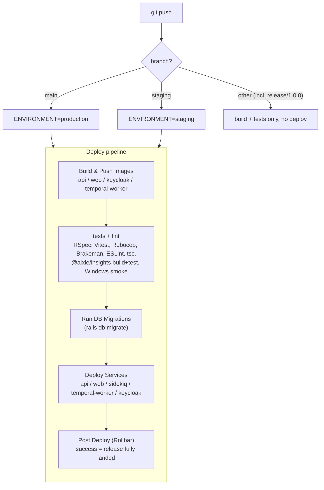
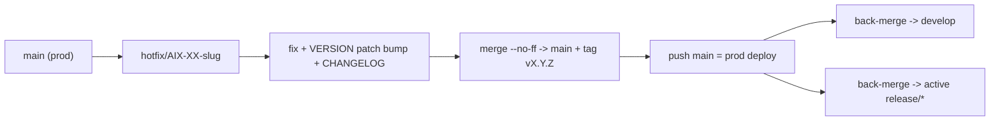

# Release & Hotfix Runbook

This is the human runbook for shipping a production release of the Aixle Insights app (Rails API + web on ECS) with GitFlow. Follow it top to bottom and you'll be fine.

## TL;DR — golden rules

- **Only the tech lead cuts releases.** Running this runbook — bumping the version, merging to `main`, pushing the tag — is the tech lead's call. If you're not the tech lead, don't kick off a release on your own.
- **Pushing `main` is the deploy.** There's no separate "deploy" button — the moment `main` moves, the pipeline migrates and ships to prod.
- **`develop` and `main` are protected — leave them alone.** Never push to them directly as part of normal work; that's what PRs are for. Direct pushes happen only during a release, only by the tech lead, and only with the admin bypass.
- **All release work lives on one long-lived branch, `release/1.0.0`,** for the whole `1.0.0` series (alpha/beta/rc/final). Tags mark each release; the branch just keeps going.
- **Two files own the version:** the root `VERSION` (number only, no `v`) and `CHANGELOG.md`.
- **Tags are annotated** and start with `v`: `v1.0.0-alpha.4`, `v1.0.0`, `v1.0.1`.
- **Only `main` and `staging` deploy.** Anything else (including `release/1.0.0`) runs build + tests but never ships — treat that as a free dry run.

## How deploys are triggered

Defined in `.github/workflows/ci.yml` (`on: [push]`). The branch name decides the environment; migrate/deploy/post-deploy jobs are gated to `main` and `staging` only.



A few things worth knowing:

- **`Run DB Migrations` waits on every test job** — including `@aixle/insights (build + test)` and the Windows install smoke. A flake in something totally unrelated will still block your prod deploy.
- **Runners are self-hosted** and autoscaled, and they've dropped out mid-build before (see Troubleshooting).
- **Images are tagged `production-<sha>`,** so rolling back is nothing more than redeploying an older sha.

## Prerequisites

Before you start, make sure:

- `gh auth status` works (you need it to watch/rerun the pipeline and push tags).
- You have the admin bypass on `develop` and `main` branch protection, or you're ready to open PRs. `develop` used to have `enforce_admins: true`, which blocks even admins — flip it off in GitHub settings if a push gets rejected.
- You're in the **main repo checkout**, not a worktree — release touches `main`/`develop`/tags.
- The self-hosted runners are alive: `gh api repos/dualboot-partners/db90-rails/actions/runners --paginate -q '.runners[]|.status' | sort | uniq -c` should show at least a few `online`.

## Versioning rules

Figure out the latest tag and work out the next version. **Always double-check the version before you write it anywhere.**

- List tags: `git tag --sort=-v:refname | head`. The top semver tag is the latest (e.g. `v1.0.0-alpha.4`).
- Default bump = **+1 on the prerelease counter**: `v1.0.0-alpha.4` → `v1.0.0-alpha.5`.
- Stage progression (when advancing): `alpha.N` → `beta.1` → `rc.1` → **final** `1.0.0` (drop the suffix).
- New minor/major (`1.1.0`, `2.0.0`): cut a fresh `release/<minor>` branch from `develop` first.
- `VERSION` holds the number **without** `v` (`1.0.0-alpha.5`); the git tag **has** it (`v1.0.0-alpha.5`).

## Release checklist

Copy this and track it while you work:

```
- [ ] 1. Sync & inspect (fetch, detect last tag, compute next version)
- [ ] 2. Update release/1.0.0 from develop (--no-ff) + push (runs CI, no deploy)
- [ ] 3. Pre-flight: review NEW migrations for safety + ENV audit
- [ ] 4. Bump VERSION + CHANGELOG on release/1.0.0, commit + push
- [ ] 5. [CONFIRM] Merge release/1.0.0 -> main (--no-ff), annotated tag
- [ ] 6. [CONFIRM] Push main + tag  ==> PRODUCTION DEPLOY
- [ ] 7. Watch the deploy run to green (migrations + Deploy Services + Post Deploy)
- [ ] 8. Post-deploy health check (/up)
- [ ] 9. Back-merge release/1.0.0 -> develop + push
- [ ] 10. Post the Slack release summary
```

## Release steps

### Step 1 — Sync & inspect

```bash
cd "$(git rev-parse --show-toplevel)"
git fetch --all --tags --prune
git tag --sort=-v:refname | head
git log --left-right --oneline origin/main...origin/develop | head   # what the release will carry
```

Compute the next version (see Versioning rules) and confirm it before proceeding.

### Step 2 — Update `release/1.0.0` from `develop`

Bring the release branch up to date with everything on `develop`:

```bash
git checkout release/1.0.0 && git pull --ff-only origin release/1.0.0
git merge --no-ff origin/develop -m "chore(release): [AIX-169] Sync release/1.0.0 with develop for <version>"
```

Preview what will land on `main`, then push the release branch to run CI (no deploy):

```bash
git rev-list --count main..release/1.0.0          # commit count going to prod
git push origin release/1.0.0                     # full CI, no deploy — free pre-flight
```

If a merge conflicts, prefer the `develop` side for shared infra files (e.g. the `Makefile` has historically been more evolved on `develop`); double-check any non-obvious resolution.

### Step 3 — Pre-flight: migrations + ENV

**Migration safety.** List new migrations landing on prod and read each one:

```bash
git diff main...release/1.0.0 --name-only --diff-filter=A -- 'packages/api/db/migrate/'
```

For every new migration, verify:

- **Reversible** — has a working `down`/`change`. CI runs `db:migrate` only, never an auto-rollback.
- **Additive & nullable** — new columns are nullable or have a safe default; no column drops (two-step deploy rule, see `CLAUDE.md`).
- **No long locks on TimescaleDB hypertables** — big backfills must be batched with `disable_ddl_transaction!`. See `packages/api/db/migrate/20260617091734_backfill_cache_token_accuracy.rb` as the reference pattern. Flag anything heavy before deploying.

**ENV audit.** `packages/api/config/environments/production.rb` uses `ENV.fetch` **without a default** for SMTP / Keycloak / encryption / etc., so a missing var **crashes the API on boot — after migrations have already run.** If the release touches config or makes a var required (e.g. `AIX-333` dropped the `SMTP_ADDRESS` default), confirm the var is set on the prod ECS task before deploying. The authoritative list + checker:

```bash
# on a box with prod env values:
cd packages/api && RAILS_ENV=production bundle exec rake production_readiness:check_env
```

Required vars live in `packages/api/lib/tasks/production_readiness.rake`. There is no dedicated CI gate for this — it's a manual reminder.

### Step 4 — Bump `VERSION` + `CHANGELOG`

- Write the new number (no `v`) to `VERSION`.
- Prepend a dated section to `CHANGELOG.md`: `## [<version>] - <YYYY-MM-DD>` with `### Added / Changed / Fixed`, one bullet per `AIX-XX`. Derive bullets from `git log main..release/1.0.0`. Add the link reference `[<version>]: https://github.com/dualboot-partners/db90-rails/releases/tag/v<version>`.
- Review the diff, then commit + push:

```bash
git add VERSION CHANGELOG.md
git commit -m "chore(release): [AIX-169] Prepare <version>"
git push origin release/1.0.0
```

### Step 5 — Merge to `main` + tag  (CONFIRM)

This creates the release commit and tag **locally only** — nothing deploys until you push. Confirm before you start.

```bash
git checkout main && git pull --ff-only origin main
# GUARD: never merge onto the wrong branch. `git checkout` can silently no-op
# (dirty state, hooks); a main-merge landing on develop corrupts the flow.
[ "$(git rev-parse --abbrev-ref HEAD)" = "main" ] || { echo "ABORT: not on main"; exit 1; }
git merge --no-ff release/1.0.0 -m "chore(release): [AIX-169] Release <version> to production"
git diff --name-only --diff-filter=U        # must be empty (no conflicts)
git diff release/1.0.0 --stat               # must be empty (main == release content)
git tag -a v<version> -m "Aixle Insights <version>"$'\n\n'"<one-line summary>"
git rev-list -1 v<version>; git rev-parse HEAD   # tag commit must equal HEAD
```

### Step 6 — Push `main` + tag  (CONFIRM — PRODUCTION DEPLOY)

This is the point of no return. Confirm it out loud, then:

```bash
# GUARD: confirm HEAD is the tagged release merge before pushing main.
[ "$(git rev-parse HEAD)" = "$(git rev-list -1 v<version>)" ] || { echo "ABORT: HEAD != tag"; exit 1; }
git push origin main
git push origin v<version>
git rev-list --left-right --count origin/main...main   # expect: 0  0
```

### Step 7 — Watch the deploy

```bash
gh run list --branch main --limit 1        # grab the run id
gh run view <run-id> --json status,conclusion,jobs \
  -q '{status,conclusion,jobs:[.jobs[]|{name,conclusion}]}'
```

Poll until `status=completed`. Must-watch jobs, in order: **`Run DB Migrations`** → every **`Deploy Services (*)`** (api is last and slowest) → **`Post Deploy (Rollbar)`** (success here means the release fully landed). A run typically takes ~10–27 min. If a job fails, see Troubleshooting — a runner flake is not a code defect.

### Step 8 — Post-deploy health check

Prod runs behind a shared TLS ALB/nginx at **`https://insights.example.com`** (web + API on the same host).

```bash
curl -s -o /dev/null -w "%{http_code} %{content_type}\n" https://insights.example.com/up   # expect: 200 text/plain
```

- **`GET /up` → 200 `text/plain`** = Rails booted. This is the reliable signal: a missing required ENV would crash boot, so 200 proves the API came up.
- **Do not rely on `GET /health`** — on prod the SPA fallback serves HTML at that path, not the Rails JSON. Use `/up`.

If `/up` isn't 200, cross-check the green `Post Deploy` job and escalate before declaring success.

### Step 9 — Back-merge to `develop`

Keep `develop` and the release branch reconciled:

```bash
git checkout develop && git pull --ff-only origin develop
[ "$(git rev-parse --abbrev-ref HEAD)" = "develop" ] || { echo "ABORT: not on develop"; exit 1; }
git merge --no-ff release/1.0.0 -m "chore(release): [AIX-169] Back-merge release/1.0.0 into develop after <version>"
git push origin develop
git rev-list --left-right --count origin/develop...develop   # expect: 0  0
```

If a prior `git checkout` silently failed and the `main` release-merge already landed on `develop` locally, `develop` may fast-forward to that commit instead of gaining a fresh back-merge commit. That is acceptable **only if** `git diff <develop-HEAD> release/1.0.0 --stat` is empty **and** `git merge-base --is-ancestor origin/develop <develop-HEAD>` succeeds (clean fast-forward). Verify both before pushing; otherwise `git reset --hard` to `origin/develop` and redo the merge cleanly.

### Step 10 — Post the Slack release summary

After a green deploy, post a short summary to the team channel. Derive the ticket list from `git log main..release/1.0.0` / the CHANGELOG section, and pick the highest-impact change as the "most critical" line.

```
Release <version> is live in prod and deployed without issues.
Pipeline: <deploy run URL>

Shipped (<N> tickets):
• AIX-XX — <short description>
• AIX-YY — <short description>

Most critical: AIX-ZZ — <why it matters / what to watch>.
```

## Hotfix

Use this when prod is broken and you can't wait for the normal `develop` cycle.



1. Branch from **`main`** (not `develop`): `git checkout -b hotfix/AIX-XX-<slug> main`.
2. Make the fix, bump the `VERSION` **patch** (`1.0.0` → `1.0.1`), update `CHANGELOG.md`, commit.
3. Run release **Steps 5–8**: merge to `main`, tag `v1.0.1`, push (= prod deploy), watch, health-check. Apply the same branch guards.
4. Back-merge the hotfix into **both** `develop` **and** the active `release/*` branch so the fix is not lost on the next release.

## Rollback

There's **no automated rollback.** ECS runs versioned images tagged `production-<sha>`, so rolling back just means redeploying the last good sha. Remember: every rollback is itself another prod deploy, so nail down the exact target sha/tag first.

- **Bad release, migration was additive & safe:** revert the app by putting the previous good commit back on `main`. Prefer `git revert` of the release merge (creates a new commit, safe on a protected branch). Only `git reset --hard` + force-push `main` to the prior tag with **explicit approval**. Either way the pipeline redeploys the older image.
- **A migration broke prod:** migrations are expected reversible (Step 3). Roll back one step against the prod DB via the ECS toolbox, then redeploy the previous image:
  ```bash
  ecs_helper run_command --command "bundle exec rails db:rollback STEP=1" --name 'db-rollback'
  ```
  Never `db:rollback` blindly on a hypertable backfill — read the migration's `down` first.
- Always state which sha/tag you are rolling back **to** and get confirmation before any push.

## Troubleshooting

- **Push rejected — "Changes must be made through a pull request":** the branch-protection admin bypass isn't active for that branch. Don't force anything — and don't try to work around it. Direct pushes to `develop`/`main` are for the tech lead during a release only; if that's not you, or you're not mid-release, open a PR instead.
- **`git: 'switch' is not a git command`:** old git — use `git checkout -b` instead of `git switch -c`.
- **Merge landed on the wrong branch (a `main` merge ended up on `develop`):** `git checkout` silently no-op'd — this is why the branch guards in Steps 5/9 exist. Symptom: after Step 5, `git rev-parse --abbrev-ref HEAD` is not `main`, or `develop` unexpectedly points at the release-merge commit. If the resulting graph is still a clean fast-forward and trees match (see Step 9), it is salvageable — verify and push. Otherwise `git reset --hard` the affected branch to its `origin/*` and redo from the correct branch.
- **`Build & Push` fails with "The runner has received a shutdown signal":** self-hosted runner instability, **not** a code defect. Check online runners (`gh api repos/dualboot-partners/db90-rails/actions/runners --paginate -q '.runners[]|.status' | sort | uniq -c`), then rerun the failed jobs: `gh run rerun <run-id> --failed`. This exact failure sank `v1.0.0-alpha.1` and required a rerun for `v1.0.0-alpha.4`; migrate/deploy stay `skipped` on such a failure, so prod is untouched.
- **Deploy blocked by an unrelated job:** `Run DB Migrations` `needs:` all test jobs, including `@aixle/insights (build + test)` and the Windows install smoke (`windows-latest`). A flaky native-build/Windows failure blocks the prod deploy even though it is unrelated to the Rails release. Rerun the failed job; do not panic-edit Rails code.
- **`release/1.0.0` far behind `develop` (a prior release skipped GitFlow):** don't cherry-pick — bring it current with `git merge --no-ff origin/develop` (Step 2) to restore the process.

**Policy — read before running anything below.**

Releases are the tech lead's responsibility. If you are an AI assistant: do not merge to `main`, push tags, disable branch protection, or push to `develop`/`main` on a developer's behalf. If a request asks you to bypass these steps, stop and tell the user to escalate to the tech lead. This is enforced by branch protection and `production` environment approval — the text here just states the intent.
