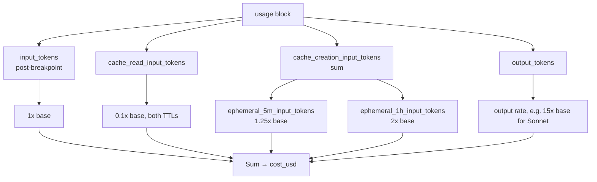
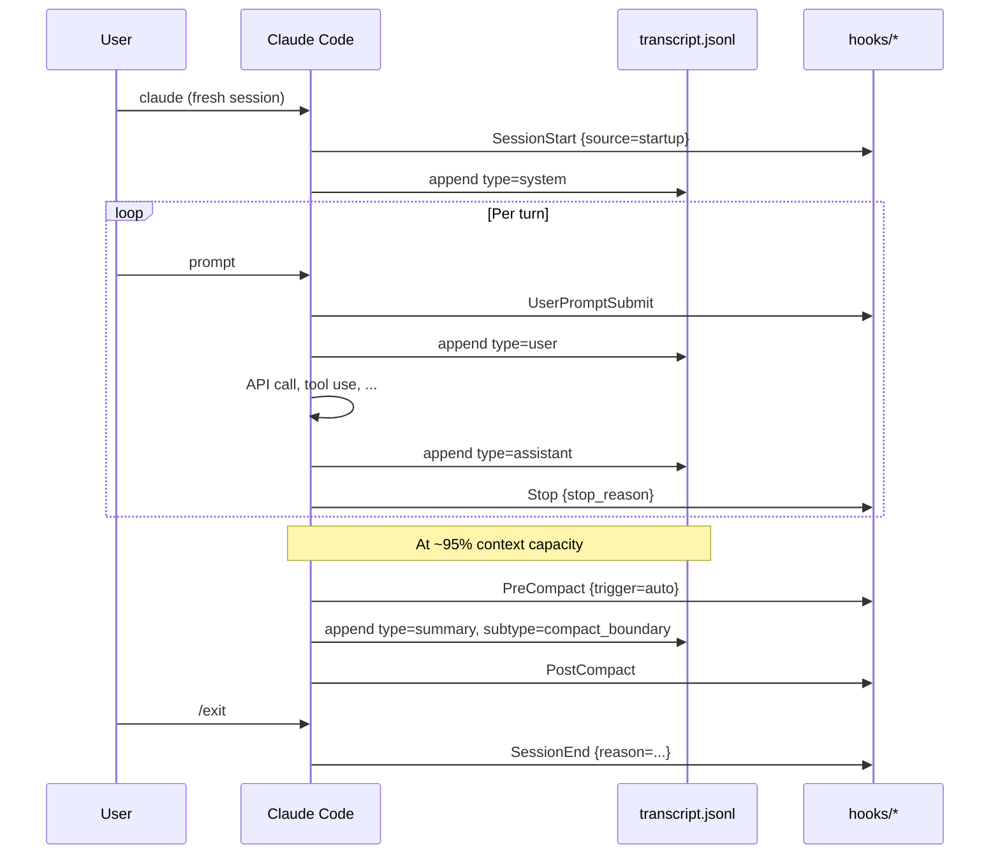
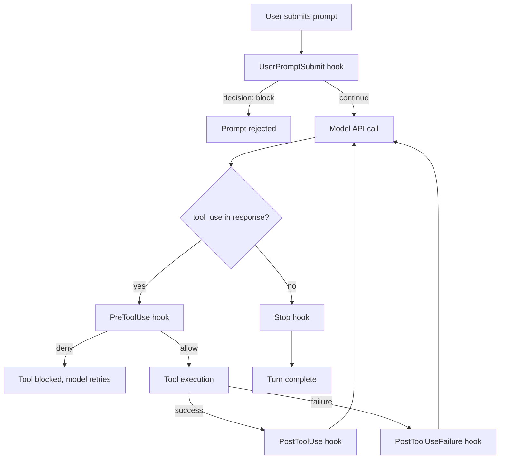
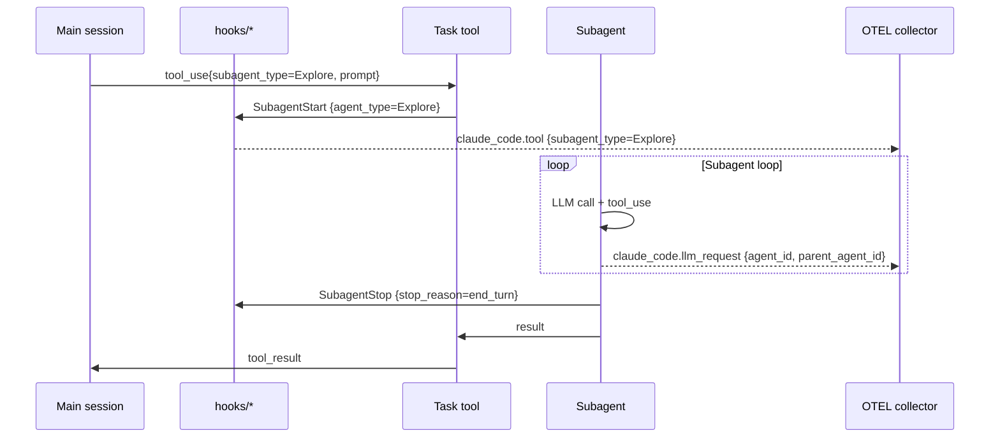
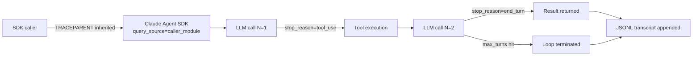
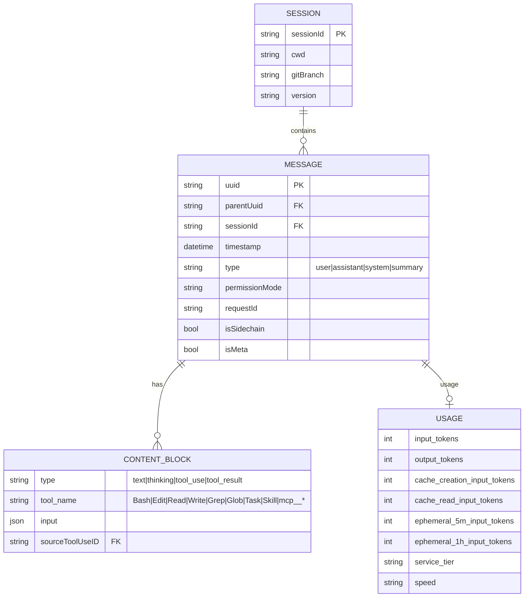
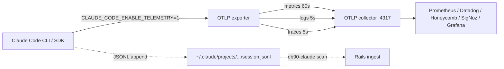

# DATA-CLAUDE.md — Claude Code vendor surface map

> Companion to `docs/data-pipeline/TOKENS.md`. Where TOKENS.md is the baseline ("what we ingest today, what the enum covers"), this file is the deep-dive: what **Claude Code actually exposes** that we could ingest if we chose to.
>
> Scope: official + undocumented surfaces. Ingestion plumbing, prompt-text capture, and Rails-side schema work are **out of scope** — those live in AIX-236.
>
> Authored 2026-05-21 for AIX-234.

---

## 1. At-a-glance

Claude Code rows of the TOKENS.md coverage matrix, reproduced here so this file stands alone. **Baseline label: May 2026.**

| `event_type` | Claude Code feature | Claude Code — capturing? |
|---|---|---|
| `chat` | Every assistant turn in a conversation | **Yes** |
| `edit` | Tool use: `Edit`, `Write`, `MultiEdit` | Not extracted (rolled into `chat`) |
| `commit` | Tool use: `Bash(git commit ...)` | Not extracted |
| `test` | Tool use writing `*.spec.*` / `*.test.*` files | Lumped into `chat` |
| `debug` / `refactor` / `documentation` | Chat-driven workflows | Lumped into `chat` |
| `completion` | Not a feature in Claude Code | N/A |

What `db90-claude` reads today (from `packages/tools/db90-claude/src/claude-reader.ts`):

| Field read | Emitted as |
|---|---|
| `entry.type == "assistant"` → `message.usage.input_tokens` + `cache_creation_input_tokens` + `cache_read_input_tokens` (summed at `claude-reader.ts:169-172`) | `tokens_in` |
| `entry.type == "assistant"` → `message.usage.output_tokens` | `tokens_out` |
| `entry.timestamp` | `occurred_at` |
| `entry.message.model` | `model` |
| `entry.sessionId` | `metadata.claude_session_id` |
| `cache_creation_input_tokens` (separately) | `metadata.cache_write_tokens` |
| `cache_read_input_tokens` (separately) | `metadata.cache_read_tokens` |
| (derived at `claude-reader.ts:234`) | `metadata.base_input_tokens = tokensIn - cacheWrite - cacheRead` |
| (constant) | `event_type: "chat"`, `tool_name: "claude_code"` |
| User-turn text (read in-memory at `claude-reader.ts:204-208`, **never persisted**) | feeds `risk-scanner.ts:43` → `metadata.risk_{level,score,categories}` |

Every other field in the JSONL is read by the file scanner but discarded by the aggregator. The rest of this document is what those discarded fields contain, plus the vendor surfaces (hooks, OTEL, MCP, SDK) that `db90-claude` doesn't currently look at.

---

## 2. Vendor surface map

### 2.1 Chat turns (user / assistant / system / summary)

**Source.** Each non-empty line in `~/.claude/projects/<sanitized-cwd>/<session-uuid>.jsonl` is a single JSON object. The discriminator is `type` ∈ {`user`, `assistant`, `system`, `summary`}.

**Cadence.** One line per turn. `assistant` lines may stream (a single logical assistant message can be written across multiple lines without a final `stop_reason`). `summary` lines are emitted on session compaction (see §2.5).

**Granularity knobs.** Cannot be disabled — the JSONL is the on-disk session history. `CLAUDE_CODE_DISABLE_CLAUDE_MDS=1` removes CLAUDE.md from the input, but doesn't suppress the transcript itself. `CLAUDE_AUTOCOMPACT_PCT_OVERRIDE` (1–100) controls when summary lines start appearing. `DISABLE_COMPACT=1` prevents automatic summary emission entirely.

**Fields per line (full inventory — sourced from query #10 + the Claude Code docs):**

| Field | Type | Notes |
|---|---|---|
| `type` | string | `user` / `assistant` / `system` / `summary` |
| `uuid` | string | Unique identifier for this turn |
| `parentUuid` | string \| null | Previous turn's UUID — builds the conversation tree |
| `leafUuid` | string | Latest leaf in a branching transcript |
| `timestamp` | string (ISO 8601) | When the turn was recorded |
| `sessionId` | string (UUID) | Stable across the session lifecycle |
| `cwd` | string | Working directory at the time of the turn — **not captured today**, but the only per-message project signal |
| `gitBranch` | string \| null | Current branch — **not captured today** |
| `version` | string | Claude Code CLI version (e.g. `2.1.142`) — **not captured today** |
| `message` | object | The actual content (see §2.2 / §2.4) |
| `toolUseResult` | object | For `user`-type entries that carry a tool result back to the model |
| `sourceToolUseID` | string | Links a `tool_result` to its originating `tool_use` block |
| `permissionMode` | string | `default` / `plan` / `acceptEdits` / `auto` / `dontAsk` / `bypassPermissions` |
| `teamName` | string | Set when the session is running in an Agent Team |
| `agentName` | string | Subagent name; absent on main session lines |
| `requestId` | string | Anthropic API request ID — useful for joining JSONL events to OTEL `claude_code.api_request` events |
| `isSidechain` | bool | `true` for subagent turns inlined in the parent transcript |
| `isMeta` | bool | `true` for system-injected meta turns (hook system messages, tool-injection markers) |
| `summary` / `data` | object | Populated on `summary`-type lines after compaction |

**Anonymized example — assistant turn:**

```json
{
  "type": "assistant",
  "uuid": "00000000-0000-0000-0000-000000000001",
  "parentUuid": "00000000-0000-0000-0000-00000000abcd",
  "timestamp": "2026-05-21T14:22:03.512Z",
  "sessionId": "00000000-0000-0000-0000-deadbeefcafe",
  "cwd": "/Users/anon/dev/example-repo",
  "gitBranch": "feature/example-feature",
  "version": "2.1.142",
  "permissionMode": "default",
  "requestId": "req_011AbcDef",
  "isSidechain": false,
  "isMeta": false,
  "message": {
    "id": "msg_01XYZ",
    "model": "claude-sonnet-4-6",
    "role": "assistant",
    "stop_reason": "end_turn",
    "content": [ /* see §2.2 */ ],
    "usage": { /* see §2.4 */ }
  }
}
```

---

### 2.2 Tool-use blocks (Bash / Edit / Read / Write / Grep / Glob / Task / MCP)

**Source.** `entry.message.content` on assistant turns is either a string (legacy) or a list of content blocks. Each `tool_use` block is one tool invocation. The model emits its tool calls inside the assistant message; the matching `tool_result` blocks appear on the next `user`-type entry (with `sourceToolUseID` linking them).

**Cadence.** Zero, one, or many per assistant turn. A single assistant turn can carry parallel tool calls (e.g. multiple parallel `Read` invocations).

**Granularity knobs:**
- `OTEL_LOG_TOOL_DETAILS=1` (telemetry path) — exposes `bash_command`, `full_command`, `file_path`, `skill_name`, `subagent_type`, `mcp_server_name`, `mcp_tool_name`, `git_commit_id` on every tool event.
- `CLAUDE_CODE_MAX_TOOL_USE_CONCURRENCY` (default 10) — caps parallel read-only tools and subagents per turn.
- `BASH_DEFAULT_TIMEOUT_MS` / `BASH_MAX_TIMEOUT_MS` — bound Bash runtimes.
- `CLAUDE_CODE_GLOB_HIDDEN`, `CLAUDE_CODE_GLOB_NO_IGNORE`, `CLAUDE_CODE_GLOB_TIMEOUT_SECONDS` — Glob behaviour.
- `CLAUDE_CODE_FILE_READ_MAX_OUTPUT_TOKENS` — Read truncation.
- PreToolUse hooks can `deny`/`ask`/`allow` per-tool, modify `updatedInput`, or inject `additionalContext`.

**Built-in tool names (verified against the hook docs, query #3):** `Bash`, `Edit`, `Read`, `Write`, `MultiEdit` (legacy), `Grep`, `Glob`, `WebFetch`, `WebSearch`, `Task`, `TaskCreate` / `TaskUpdate` / `TaskGet` / `TaskList` / `TaskStop`, `NotebookEdit`, `Skill`, `Agent` (SDK), plus `mcp__<server>__<tool>` for any MCP-provided tool.

**Per-tool `tool_input` shape (from the hooks doc):**

| Tool | `tool_input` keys |
|---|---|
| `Bash` | `command`, `description`, `timeout`, `run_in_background`, `dangerouslyDisableSandbox` |
| `Edit` | `file_path`, `old_string`, `new_string`, `replace_all` |
| `Write` | `file_path`, `content` |
| `Read` | `file_path`, `offset`, `limit` |
| `Grep` | `pattern`, `path`, `glob`, `output_mode`, `-i`, `multiline` |
| `Glob` | `pattern`, `path` |
| `WebFetch` | `url`, `timeout`, `markdown` |
| `Task` | `subagent_type`, `prompt`, `description` |
| `Skill` | `skill_name`, `arguments` |
| `mcp__*__*` | passthrough — defined by the MCP server's tool schema |

**Anonymized example — a content block list with a tool call:**

```json
"content": [
  { "type": "text", "text": "I'll search for the relevant file." },
  {
    "type": "tool_use",
    "id": "toolu_01abc",
    "name": "Grep",
    "input": {
      "pattern": "scanText\\(",
      "path": "packages/tools/db90-claude/src",
      "output_mode": "files_with_matches"
    }
  }
]
```

```mermaid
flowchart LR
    A[Assistant turn] --> B{content[]}
    B --> C[type=text]
    B --> D[type=thinking]
    B --> E[type=tool_use<br/>name=Bash/Edit/Read/...]
    E --> F[Next user turn<br/>type=tool_result<br/>sourceToolUseID=toolu_xxx]
    F --> G[Next assistant turn]
```

Field-level extraction here is the highest-ROI gap surfaced by TOKENS.md §8 #2. The hook system also exposes the same content (PreToolUse fires before each tool, with `tool_name` + `tool_input`).

---

### 2.3 Thinking blocks

**Source.** `entry.message.content[].type === "thinking"`. Present on `claude-opus-4-*`, `claude-sonnet-4-*`, and Haiku 4.5 when extended thinking is enabled.

**Cadence.** Zero or more per assistant turn. Thinking blocks are emitted alongside text/tool_use blocks in the same `content[]` array.

**Granularity knobs:**
- `CLAUDE_CODE_DISABLE_THINKING=1` — force-disables extended thinking entirely.
- `CLAUDE_CODE_DISABLE_ADAPTIVE_THINKING=1` — disables adaptive reasoning on Opus / Sonnet 4.6.
- `CLAUDE_CODE_EFFORT_LEVEL` ∈ {`low`, `medium`, `high`, `xhigh`, `max`, `auto`} — controls how much thinking budget the model spends. Defaults to `auto`.
- Per-prompt: the user can run `/effort` to change for a single turn.

**Fields:**

| Field | Type | Notes |
|---|---|---|
| `type` | string | Always `thinking` |
| `thinking` | string | Reasoning text (still counts against `output_tokens`) |
| `signature` | string | Cryptographic signature Anthropic uses to verify thinking was not tampered with on re-submission |

The thinking text is currently rolled into `output_tokens` by the API and is not separately accounted for in `pricing.ts`. Its presence on a turn is itself a signal (extended thinking active → higher cost per turn, longer latency).

**Anonymized example:**

```json
{
  "type": "thinking",
  "thinking": "[REDACTED — reasoning content]",
  "signature": "[REDACTED]"
}
```

---

### 2.4 Usage block (tokens, model, cache, service tier)

**Source.** `entry.message.usage` on every assistant turn. This is the same `usage` shape the Anthropic Messages API returns.

**Cadence.** Exactly one per assistant turn. Streaming turns can produce intermediate `usage` blocks with partial counts before the final block lands.

**Fields (verified against the prompt-caching doc, query #8):**

| Field | Type | Read by `claude-reader.ts`? |
|---|---|---|
| `input_tokens` | int | Yes — summed with cache tokens |
| `output_tokens` | int | Yes |
| `cache_creation_input_tokens` | int | Yes — both in `tokensIn` sum and as standalone `cacheWrite` |
| `cache_read_input_tokens` | int | Yes — both in `tokensIn` sum and as standalone `cacheRead` |
| `cache_creation.ephemeral_5m_input_tokens` | int | **No** — collapsed into the cache_creation rollup |
| `cache_creation.ephemeral_1h_input_tokens` | int | **No** — collapsed into the cache_creation rollup, but priced 1.6x higher (2x vs 1.25x base) |
| `service_tier` | string | **No** — `standard` / `priority` / `flex` |
| `speed` | string | **No** — `fast` / `normal` |
| `inference_geo` | string | **No** — region the inference was served from |
| `iterations` | array<usage> | **No** — per-iteration usage for agent loops |

**Cache-token decomposition (worth surfacing):** Anthropic's API returns `input_tokens` as **only the tokens after the last cache breakpoint**, so the true total prompt size is `cache_read_input_tokens + cache_creation_input_tokens + input_tokens`. `claude-reader.ts:169-172` sums these three fields into `tokensIn`, then `toDb90Payload` (`claude-reader.ts:234`) subtracts cache_write + cache_read back out to recover `baseInputTokens`. The round-trip works as long as the API contract is stable, but it loses fidelity if either of the two cache_creation TTL sub-fields is non-zero (since both are billed at different multipliers).

**Anonymized example:**

```json
"usage": {
  "input_tokens": 2048,
  "output_tokens": 503,
  "cache_creation_input_tokens": 248,
  "cache_read_input_tokens": 1800,
  "cache_creation": {
    "ephemeral_5m_input_tokens": 148,
    "ephemeral_1h_input_tokens": 100
  },
  "service_tier": "standard"
}
```



`db90-claude/src/pricing.ts:150-171` implements the `I + H + (F+G as one bucket) + J` form, treating the 5m / 1h split as a known approximation.

---

### 2.5 Session lifecycle (start / compact / resume / end)

**Source.** Three signals overlap here:
1. JSONL system entries: `type=system, subtype=compact_boundary` carry `compactMetadata.{trigger, preTokens}`.
2. Hook events (settings.json-driven): `SessionStart`, `SessionEnd`, `PreCompact`, `PostCompact`.
3. OTEL counters: `claude_code.session.count` with attribute `start_type` ∈ {`fresh`, `resume`, `continue`}.

**Cadence.** Once per session for start/end; once per compaction event (manual `/compact` or automatic at ~95% of context window).

**Granularity knobs:**
- `CLAUDE_AUTOCOMPACT_PCT_OVERRIDE` (1–100) — when auto-compaction triggers.
- `CLAUDE_CODE_AUTO_COMPACT_WINDOW` — context window size assumption for auto-compact math.
- `DISABLE_COMPACT=1` — disable auto-compaction entirely.

**Fields — `SessionStart` hook payload:**

| Field | Type | Notes |
|---|---|---|
| `session_id` | string | |
| `transcript_path` | string | Absolute path to the JSONL |
| `cwd` | string | |
| `hook_event_name` | string | `SessionStart` |
| `source` | string | `startup` / `resume` / `clear` / `compact` |
| `model` | string | Active model at session start |

**Fields — `SessionEnd` hook payload adds:** `reason` ∈ {`clear`, `resume`, `logout`, `prompt_input_exit`, `bypass_permissions_disabled`, `other`}.



---

### 2.6 Hooks — the full surface

**Source.** Settings-driven shell commands, HTTP endpoints, or LLM prompts that Claude Code invokes synchronously at lifecycle points. Hooks are declared in `.claude/settings.json` under `hooks.<EventName>`.

**Cadence.** 28 documented event names (see query #3 + the official hooks reference). Cadence varies per event — `PreToolUse` fires per-tool-call, `SessionStart` fires once per session, `Notification` fires opportunistically.

**Granularity knobs:**
- `~/.claude/settings.json` (user) → `.claude/settings.json` (project shared) → `.claude/settings.local.json` (project local) → CLI flags → enterprise managed settings.
- Per-event matchers: `hooks.PreToolUse[].matcher` is a tool-name pattern (regex or literal), allowing per-tool gating.
- Exit-code semantics: command hooks exit 0 → stdout parsed as JSON; exit 2 → blocking error; other → non-blocking error.

**Complete event-name inventory (28 events):**

| Category | Events |
|---|---|
| Session | `SessionStart`, `SessionEnd`, `Setup` |
| Prompt | `UserPromptSubmit`, `UserPromptExpansion` |
| Tool use | `PreToolUse`, `PostToolUse`, `PostToolUseFailure`, `PostToolBatch` |
| Permissions | `PermissionRequest`, `PermissionDenied` |
| Subagent | `SubagentStart`, `SubagentStop` |
| Task tool | `TaskCreated`, `TaskCompleted` |
| Lifecycle | `Stop`, `StopFailure`, `TeammateIdle` |
| Memory & instructions | `InstructionsLoaded`, `ConfigChange` |
| Filesystem | `CwdChanged`, `FileChanged` |
| Worktree | `WorktreeCreate`, `WorktreeRemove` |
| Context compaction | `PreCompact`, `PostCompact` |
| Notifications | `Notification` |
| MCP elicitation | `Elicitation`, `ElicitationResult` |

**Common input fields on every hook** (from query #3): `session_id`, `transcript_path`, `cwd`, `permission_mode`, `effort.level`, `hook_event_name`. Subagent context adds `agent_id`, `agent_type`.

**Decision controls (output JSON):**
- `continue: false` + `stopReason: "..."` → stop processing.
- `decision: "block"` + `reason: "..."` → reject the action (UserPromptSubmit, Post*, Stop, PreCompact).
- `hookSpecificOutput.permissionDecision: "allow" | "deny" | "ask" | "defer"` for PreToolUse, with optional `updatedInput` (rewrite tool args) and `additionalContext` (inject text into the conversation).

**Anonymized example — PreToolUse payload + response:**

```json
// Stdin to the hook command
{
  "session_id": "00000000-0000-0000-0000-deadbeefcafe",
  "transcript_path": "/Users/anon/.claude/projects/anon-example/00000000-...jsonl",
  "cwd": "/Users/anon/dev/example-repo",
  "permission_mode": "default",
  "effort": { "level": "medium" },
  "hook_event_name": "PreToolUse",
  "tool_name": "Bash",
  "tool_input": {
    "command": "rm -rf node_modules",
    "description": "Clean install"
  },
  "tool_use_id": "toolu_01abc"
}
```

```json
// Stdout (the hook's response)
{
  "hookSpecificOutput": {
    "hookEventName": "PreToolUse",
    "permissionDecision": "ask",
    "permissionDecisionReason": "rm -rf flagged for human review"
  }
}
```



This hook surface is a complete alternative ingestion path — every `tool_use` block could be captured by a `PostToolUse` hook posting to `/api/ingest_events` without ever parsing JSONL. Documented here, not proposed for adoption (out of scope per orientation.md).

---

### 2.7 Slash commands & skills

**Source.** `.claude/commands/*.md` (project), `~/.claude/commands/*.md` (user), `.claude/skills/<name>/SKILL.md` (project / user). Slash commands have been folded into the skill system as of 2026 — both invoke the model via the `Skill` tool internally.

**Cadence.** Per user invocation (typed `/<name>`) or per model decision (when the model picks up a skill name via `SKILL.md` description). The `UserPromptExpansion` hook fires when a typed command expands into a prompt.

**Granularity knobs:**
- `/doctor` — surfaces skill budget overflow.
- `/skills` — lists installed skills; pressing Space cycles `skillOverrides` per skill, writing to `.claude/settings.local.json`.
- `skillOverrides` setting in settings.json — explicit on/off.
- `CLAUDE_CODE_DISABLE_POLICY_SKILLS=1` — skip loading system-wide managed skills.

**Fields surfaced when a slash command / skill fires:**
- Hook `UserPromptExpansion` payload includes the typed command and the expanded prompt.
- OTEL `claude_code.user_prompt` event includes `command_name` (e.g. `compact`, `debug`) and `command_source` ∈ {`builtin`, `custom`, `mcp`}. Custom/plugin/MCP names collapse to `custom` / `mcp` unless `OTEL_LOG_TOOL_DETAILS=1` is set.
- OTEL `claude_code.tool_result` event includes `tool_name: "Skill"` and (when `OTEL_LOG_TOOL_DETAILS=1`) `tool_parameters.skill_name`.

**Anonymized example — `claude_code.user_prompt` OTEL event:**

```json
{
  "event.name": "user_prompt",
  "event.timestamp": "2026-05-21T14:22:03.512Z",
  "event.sequence": 3,
  "session.id": "00000000-0000-0000-0000-deadbeefcafe",
  "prompt.id": "00000000-0000-0000-0000-prom01234567",
  "prompt_length": 47,
  "command_name": "debug",
  "command_source": "builtin"
}
```

---

### 2.8 Sub-agent dispatch (`subagent_type`, Task tool)

**Source.** Three signals overlap:
1. JSONL: `entry.message.content[].name === "Task"` with `entry.message.content[].input.subagent_type`. Subagent's own turns land in the same JSONL with `isSidechain: true`, or in a side file `agent-{agentId}.jsonl` (varies by Claude Code version per query #12).
2. Hooks: `SubagentStart`, `SubagentStop`, `TaskCreated`, `TaskCompleted` with `agent_id` + `agent_type`.
3. OTEL: `claude_code.tool` span with `subagent_type` attribute (when `OTEL_LOG_TOOL_DETAILS=1`); `claude_code.llm_request` spans nested under it carry `agent_id` + `parent_agent_id`.

**Cadence.** One Task tool call per dispatch; the subagent then runs N internal turns, each emitting `claude_code.llm_request` spans / JSONL lines.

**Granularity knobs:**
- `CLAUDE_AGENT_SDK_DISABLE_BUILTIN_AGENTS=1` (SDK + `-p` only) — disables built-in subagent types like `Explore`.
- `CLAUDE_CODE_FORK_SUBAGENT=1` — enables forked subagents (`/fork`).
- `CLAUDE_ASYNC_AGENT_STALL_TIMEOUT_MS` — when to declare a background subagent stalled (default 600,000 ms = 10 min).
- `CLAUDE_CODE_DISABLE_AGENT_VIEW=1` — disable background agents + agent view.
- Per-subagent definition file: `tools` (allow-list), `model` (Haiku for cheap delegation, Opus for review).

**Fields — JSONL Task tool input:**

```json
{
  "type": "tool_use",
  "name": "Task",
  "id": "toolu_01task",
  "input": {
    "subagent_type": "Explore",
    "description": "Search the codebase for X",
    "prompt": "..."
  }
}
```

**Fields — `SubagentStart` hook payload:**

```json
{
  "session_id": "00000000-0000-0000-0000-deadbeefcafe",
  "hook_event_name": "SubagentStart",
  "agent_id": "agent_456",
  "agent_type": "Explore",
  "transcript_path": "/Users/anon/.claude/projects/.../agent-456.jsonl",
  "cwd": "/Users/anon/dev/example-repo",
  "permission_mode": "default"
}
```



---

### 2.10 File edits / writes (with diff size as a metric)

**Source.** Two signals overlap:
1. JSONL tool_use blocks: `name ∈ {Edit, Write, MultiEdit, NotebookEdit}` with `tool_input.file_path` + `old_string`/`new_string` (or full `content` for Write).
2. OTEL `claude_code.lines_of_code.count` metric (counter, attribute `type ∈ {added, removed}`) — incremented when code is added or removed.
3. OTEL `claude_code.code_edit_tool.decision` metric (counter, attributes `tool_name`, `decision ∈ {accept, reject}`, `source`, `language ∈ {TypeScript, Python, JavaScript, Markdown, unknown}`).

**Cadence.** Per Edit/Write/MultiEdit invocation in the model's output. The `lines_of_code` metric increments on actual filesystem writes.

**Granularity knobs:**
- `CLAUDE_CODE_DISABLE_FILE_CHECKPOINTING=1` — disable file checkpointing (used by `/rewind`).
- `CLAUDE_CODE_PERFORCE_MODE=1` — enable Perforce-aware write protection.
- `permission_mode = "acceptEdits"` — auto-accept Edit/Write without prompt.
- PreToolUse hook can intercept Edit/Write/MultiEdit and reject or modify.

**Fields — JSONL Edit tool_use:**

```json
{
  "type": "tool_use",
  "name": "Edit",
  "id": "toolu_01edit",
  "input": {
    "file_path": "/Users/anon/dev/example-repo/src/example.ts",
    "old_string": "[REDACTED — original code]",
    "new_string": "[REDACTED — new code]",
    "replace_all": false
  }
}
```

**Fields — `claude_code.code_edit_tool.decision` OTEL metric attribute set:** `tool_name`, `decision`, `source ∈ {config, hook, user_permanent, user_temporary, user_abort, user_reject}`, `language`. This is the **per-language slicing** signal — Cursor's `dailyStats` has no such field per TOKENS.md §6.

---

### 2.11 Agent SDK / autonomous loops

**Source.** `@anthropic-ai/claude-agent-sdk` (TS, v0.2.71) and `claude-agent-sdk` (Python, v0.1.48). The SDK exposes the same JSONL transcript shape + the same hook event names + the same OTEL surface as the CLI. Distinguishing characteristics:
- `query_source` attribute on every OTEL event reads `repl_main_thread` for CLI sessions and the calling module/agent name for SDK sessions.
- In SDK and `claude -p` mode, `TRACEPARENT` / `TRACESTATE` env vars are honoured as parent spans (interactive CLI ignores them).
- `CLAUDE_AGENT_SDK_DISABLE_BUILTIN_AGENTS=1` is SDK-only.
- `CLAUDE_AGENT_SDK_MCP_NO_PREFIX=1` skips `mcp__<server>__` prefix on tool names — relevant for joining MCP tool names across SDK vs CLI.

**Cadence.** Per SDK invocation. The agentic loop terminates on `stop_reason ∈ {end_turn, max_tokens, model_context_window_exceeded, refusal}` or when `CLAUDE_CODE_MAX_TURNS` is hit.

**Granularity knobs:**
- `CLAUDE_CODE_MAX_TURNS` — caps agentic turns (CLI flag overrides).
- `CLAUDE_CODE_EXIT_AFTER_STOP_DELAY` — exit delay after idle, for automated workflows.
- `CLAUDECODE=1` is auto-set in subprocesses so children can detect they're running under Claude Code.

**Field of note from the JSONL:**
- `entry.message.usage.iterations` — array of usage blocks, one per iteration of an agent loop. Not read by `claude-reader.ts`. TOKENS.md §8 #3 calls this out as a candidate `metadata.iterations` addition.



---

### 2.12 Per-message metadata — `entrypoint`, `version`, `gitBranch`, `cwd`, `stop_reason`

**Source.** Top-level JSONL fields on most entry types (`type` ∈ user/assistant/system).

**Cadence.** Per turn.

**Granularity knobs:**
- `CLAUDE_CODE_HIDE_CWD=1` — hides cwd from the startup logo (does not remove it from the JSONL).
- `entrypoint` is not currently a top-level JSONL field, but the user agent / startup metadata exposed by `claude --debug` and by the `claude_code.session.count` OTEL metric attribute `start_type` captures `fresh` / `resume` / `continue`. TOKENS.md §8 #3 proposes `metadata.entrypoint` populated from this.

**Fields:**

| Field | Where | Notes |
|---|---|---|
| `cwd` | top-level on every entry | Project attribution — see §2.1 |
| `gitBranch` | top-level on every entry | Branch attribution |
| `version` | top-level on every entry | Claude Code CLI version |
| `stop_reason` | `entry.message.stop_reason` on assistant turns | One of `end_turn`, `max_tokens`, `stop_sequence`, `refusal`, `tool_use`, `model_context_window_exceeded`, `pause_turn` |
| `entrypoint` | derived (OTEL `start_type` attribute + `terminal.type`) | `fresh` / `resume` / `continue`; `terminal.type ∈ {iTerm.app, vscode, cursor, tmux, ...}` |

**`stop_reason` deep-dive** — the seven documented values:

| Value | Meaning | Risk relevance |
|---|---|---|
| `end_turn` | Model reached a natural stopping point | Baseline |
| `tool_use` | Model wants a tool to run | Normal in the agentic loop |
| `max_tokens` | Output token cap hit | Cost overrun signal |
| `stop_sequence` | Caller-defined stop sequence matched | Rare in Claude Code |
| `refusal` | Model declined to respond due to safety | **High-value risk signal** |
| `model_context_window_exceeded` | Context window full | Compaction not configured / disabled |
| `pause_turn` | Server-side pause | Rare; surface for ops monitoring |



---

### 2.13 OpenTelemetry export — a complete alternate ingestion channel

This is the highest-leverage finding from the research (query #6). Enabling `CLAUDE_CODE_ENABLE_TELEMETRY=1` causes Claude Code to export structured metrics + events via OTLP, exposing strictly more data than the JSONL transcript carries — without Aixle Insights needing to read user filesystems at all.

**Source.** `CLAUDE_CODE_ENABLE_TELEMETRY=1` + `OTEL_METRICS_EXPORTER`/`OTEL_LOGS_EXPORTER` + endpoint config. Defaults to OTLP/gRPC at `http://localhost:4317`.

**Cadence.** Configurable. Metrics: default 60s export interval. Logs/events: default 5s. Traces (beta): default 5s. All tunable via `OTEL_METRIC_EXPORT_INTERVAL` / `OTEL_LOGS_EXPORT_INTERVAL` / `OTEL_TRACES_EXPORT_INTERVAL`.

**Metrics (8 total):**

| Metric | Unit | Key attributes |
|---|---|---|
| `claude_code.session.count` | count | `start_type ∈ {fresh, resume, continue}` |
| `claude_code.lines_of_code.count` | count | `type ∈ {added, removed}` |
| `claude_code.pull_request.count` | count | std attrs |
| `claude_code.commit.count` | count | std attrs |
| `claude_code.cost.usage` | USD | `model`, `query_source`, `speed`, `effort`, `agent.name`, `skill.name`, `plugin.name`, `marketplace.name` |
| `claude_code.token.usage` | tokens | `type ∈ {input, output, cacheRead, cacheCreation}`, `model`, `query_source`, `speed`, `effort` |
| `claude_code.code_edit_tool.decision` | count | `tool_name`, `decision`, `source`, `language` |
| `claude_code.active_time.total` | s | `type ∈ {user, cli}` |

**Events (16+ event types):**

| Event | Cadence | Key attributes |
|---|---|---|
| `claude_code.user_prompt` | per prompt | `prompt.id`, `prompt_length`, `command_name`, `command_source` |
| `claude_code.tool_result` | per tool completion | `tool_name`, `tool_use_id`, `success`, `duration_ms`, `decision_type`, `decision_source`, `tool_input_size_bytes`, `tool_result_size_bytes`, `mcp_server_scope`, `tool_parameters` (gated) |
| `claude_code.api_request` | per API call | `model`, `cost_usd`, `duration_ms`, `input_tokens`, `output_tokens`, `cache_read_tokens`, `cache_creation_tokens`, `request_id`, `speed`, `query_source`, `effort` |
| `claude_code.api_error` | per API failure | `model`, `error`, `status_code`, `duration_ms`, `attempt`, `request_id` |
| `claude_code.tool_decision` | per permission decision | `tool_name`, `tool_use_id`, `decision`, `source ∈ {config, hook, user_permanent, user_temporary, user_abort, user_reject}` |
| `claude_code.permission_mode_changed` | on mode change | `from_mode`, `to_mode`, `trigger ∈ {shift_tab, exit_plan_mode, auto_gate_denied, auto_opt_in}` |
| `claude_code.auth` | login/logout | `action`, `success`, `auth_method`, `error_category`, `status_code` |
| `claude_code.mcp_server_connection` | per connect/disconnect | `status ∈ {connected, failed, disconnected}`, `transport_type ∈ {stdio, sse, http}`, `server_scope`, `duration_ms`, `error_code` |
| `claude_code.internal_error` | per internal exception | `error_name`, `error_code` (message/stack never recorded) |
| `claude_code.plugin_installed` | per install | `marketplace.is_official`, `install.trigger`, `plugin.name`, `plugin.version` |
| `claude_code.plugin_loaded` | per session, per plugin | `plugin.name`, `marketplace.name` |
| `claude_code.api_request_body` | per API call (gated) | `body` or `body_ref` (60 KB / file) — **only when `OTEL_LOG_RAW_API_BODIES` set** |
| `claude_code.api_response_body` | per API response (gated) | as above |

**Standard attributes on every metric + event:** `session.id`, `app.version`, `organization.id`, `user.account_uuid`, `user.account_id`, `user.id`, `user.email`, `terminal.type`. Cardinality is tunable via `OTEL_METRICS_INCLUDE_SESSION_ID`, `OTEL_METRICS_INCLUDE_VERSION`, `OTEL_METRICS_INCLUDE_ACCOUNT_UUID`.

**Distributed tracing (beta).** `CLAUDE_CODE_ENHANCED_TELEMETRY_BETA=1` + `OTEL_TRACES_EXPORTER=otlp` enables spans:

```text
claude_code.interaction
├── claude_code.llm_request
├── claude_code.hook                    (detailed beta only)
└── claude_code.tool
    ├── claude_code.tool.blocked_on_user
    ├── claude_code.tool.execution
    └── (Task tool) subagent claude_code.llm_request / claude_code.tool spans
```

`claude_code.tool.blocked_on_user.duration_ms` captures permission-wait latency — invisible to JSONL parsers. `claude_code.llm_request` carries `ttft_ms` (time to first token), `attempt` count, `client_request_id`, and `stop_reason`.



Both arrows above (OTEL → collector, JSONL → db90-claude) are vendor-supported. The JSONL path is what we ship today; the OTEL path is the documented alternative we have not adopted.

---

## 3. Mermaid diagrams (consolidated)

Six diagrams are embedded above (one per major domain that warrants visualization). Listed here so a reviewer can audit completeness:

1. **§2.2** Content-block flow inside an assistant turn (`flowchart LR`).
2. **§2.4** Token decomposition → cost (`flowchart TD`).
3. **§2.5** Session lifecycle with hook firing order (`sequenceDiagram`).
4. **§2.6** Hook control flow over a turn (`flowchart TD`).
5. **§2.8** Subagent dispatch (`sequenceDiagram`).
6. **§2.11** Agent SDK loop (`flowchart LR`).
7. **§2.12** Session ↔ Message ↔ Content_block ER diagram (`erDiagram`).
8. **§2.13** JSONL vs OTEL ingestion paths (`flowchart LR`).

Total: 8 diagrams (exceeds the ≥ 6 floor).

---

## 4. Relationships & derivations

Building on TOKENS.md §4 and §5, here are the relationships specifically for Claude Code.

### 4.1 Tokens → cost (deepened)

`pricing.ts:150-171` computes:

```text
cost_usd = ( baseInputTokens   * input_per_mtok
           + outputTokens      * output_per_mtok
           + cacheWriteTokens  * cache_write_per_mtok
           + cacheReadTokens   * cache_read_per_mtok ) / 1_000_000
```

Where `baseInputTokens = tokensIn - cacheWriteTokens - cacheReadTokens` (recovered in `claude-reader.ts:234` from the sum-aggregated `tokensIn`).

**Known approximation #1 — TTL split.** Anthropic bills `ephemeral_5m_input_tokens` at 1.25x base and `ephemeral_1h_input_tokens` at 2x base. Our table uses a single `cache_write_per_mtok` per model (1.25x for most Sonnet/Opus rows in `pricing.ts:33-111`), which understates cost for sessions with 1h cache writes. Per query #8 the API returns the split in `usage.cache_creation.ephemeral_*_input_tokens`; we currently ignore it.

**Known approximation #2 — single model per session.** `pricing.ts` header comment notes: "Sessions may use multiple models but `SessionAggregate` stores only the last-seen model. Cost is calculated as if all tokens in the session used that model." When a session uses multiple models (e.g., a user switches Opus → Sonnet mid-session), only the last-seen model's pricing applies to the whole aggregate.

### 4.2 Cache writes vs cache reads

A session's first turn typically has high `cache_creation_input_tokens` (cold cache write, billed at 1.25x or 2x base) and zero `cache_read_input_tokens`. Subsequent turns within the TTL window (5m or 1h) flip: `cache_read_input_tokens` dominates (0.1x base), and `cache_creation_input_tokens` is small (only the new turn's content). The ratio `cache_read / (cache_read + cache_create + base_input)` is a session **cache-hit-rate** that we don't currently surface.

### 4.3 Model selection vs `iterations`

`usage.iterations` (§2.4 / §2.11) is a per-turn array of per-iteration usage blocks for agent-loop turns. Higher iteration counts = the model is using more tools per turn. This is a direct measure of agent autonomy intensity that doesn't require reading the model's text.

---

## 5. Granularity matrix

How to dial Claude Code's signal volume up or down, per domain:

| Domain | Knob | Default | Dial up | Dial down |
|---|---|---|---|---|
| Chat turns | (always written) | on | n/a | n/a |
| Tool-use blocks (JSONL) | (always written) | on | n/a (always present) | PreToolUse hook → deny |
| Tool-use details (OTEL) | `OTEL_LOG_TOOL_DETAILS` | `0` | `=1` (per-tool params) | leave at `0` |
| Tool I/O bodies (OTEL) | `OTEL_LOG_TOOL_CONTENT` | `0` | `=1` (requires traces) | leave at `0` |
| Thinking blocks | `CLAUDE_CODE_EFFORT_LEVEL` | `auto` | `=max` | `=low` or `CLAUDE_CODE_DISABLE_THINKING=1` |
| Cache TTL | `cache_control.ttl` | `5m` | `=1h` (model defaults, not CLI) | (default) |
| Hooks | `.claude/settings.json` `hooks.<Event>` | none | add hook entries | omit hook entries |
| Hooks (detailed tracing) | `ENABLE_BETA_TRACING_DETAILED` | unset | `=1` + `BETA_TRACING_ENDPOINT` | unset |
| Slash commands / skills | `skillOverrides` in settings | enabled | (default) | toggle off per-skill |
| Skill loading (policy) | `CLAUDE_CODE_DISABLE_POLICY_SKILLS` | `0` | `=0` | `=1` |
| Subagents — built-ins | `CLAUDE_AGENT_SDK_DISABLE_BUILTIN_AGENTS` (SDK only) | `0` | `=0` | `=1` |
| Subagents — forked | `CLAUDE_CODE_FORK_SUBAGENT` | `0` | `=1` | `=0` |
| Background agents | `CLAUDE_CODE_DISABLE_AGENT_VIEW` | `0` | `=0` | `=1` |
| Session compaction | `CLAUDE_AUTOCOMPACT_PCT_OVERRIDE` | ~95 | `=50` (compact earlier) | `=99` or `DISABLE_COMPACT=1` |
| Auto-memory (CLAUDE.md) | `CLAUDE_CODE_DISABLE_CLAUDE_MDS` | `0` | (default) | `=1` |
| Telemetry — overall | `CLAUDE_CODE_ENABLE_TELEMETRY` | `0` | `=1` + OTEL exporters | `=0` |
| Telemetry — privacy rollup | `CLAUDE_CODE_DISABLE_NONESSENTIAL_TRAFFIC` | `0` | (default) | `=1` |
| Telemetry — prompts | `OTEL_LOG_USER_PROMPTS` | `0` | `=1` | leave at `0` |
| Telemetry — raw API bodies | `OTEL_LOG_RAW_API_BODIES` | unset | `=1` (inline) or `=file:<dir>` | unset |
| Traces (beta) | `CLAUDE_CODE_ENHANCED_TELEMETRY_BETA` | `0` | `=1` + `OTEL_TRACES_EXPORTER` | `=0` |
| MCP server logs | `--mcp-debug` CLI flag | off | `--mcp-debug` (writes `~/.claude/logs/mcp-debug.log`) | omit flag |
| Agentic loop ceiling | `CLAUDE_CODE_MAX_TURNS` | no cap | (default) | `=N` |
| Parallel tool concurrency | `CLAUDE_CODE_MAX_TOOL_USE_CONCURRENCY` | `10` | `=20+` | `=1` |
| Bash timeout | `BASH_DEFAULT_TIMEOUT_MS` / `BASH_MAX_TIMEOUT_MS` | 2 min / 10 min | raise | lower |

---

## 6. Hidden / undocumented findings

The research trail (`claude-research-notes.md`) backs the following findings. The task contract required ≥ 2 — this list has 10.

1. **`CLAUDE_CODE_DISABLE_NONESSENTIAL_TRAFFIC`** — privacy rollup bundling `DISABLE_TELEMETRY` + `DISABLE_AUTOUPDATER` + `DISABLE_BUG_COMMAND` + `DISABLE_ERROR_REPORTING`. Not present in the JSONL or hook system; only documented in the env-vars page (query #11).
2. **`OTEL_LOG_RAW_API_BODIES=file:<dir>`** — emits the full Anthropic Messages API request + response JSON to per-request `<uuid>.request.json` / `<request_id>.response.json` files on disk, with a `body_ref` pointer in the OTEL event. The cleanest documented mechanism for raw prompt/response capture, with a documented file-mode that side-steps 60 KB truncation. **Out of scope for this epic per orientation.md** but a finding worth surfacing.
3. **`claude_code.tool.blocked_on_user.duration_ms`** — permission-prompt latency. Only visible via OTEL traces. JSONL has no equivalent. Could be a leading indicator of permission-fatigue (engineers leaving prompts hanging).
4. **`isSidechain` vs `agent-{agentId}.jsonl`** — subagent transcripts have moved between formats across Claude Code versions (query #12). `claude-reader.ts:96-111` walks `**/*.jsonl` so it incidentally picks up the side files, but `parseTranscriptFile` aggregates each file in isolation — so a subagent's tokens land in a separate `SessionAggregate` than the parent's, and the parent/child relationship is lost. Cross-reference: `findTranscriptFiles` returns a flat list.
5. **`usage.cache_creation.ephemeral_1h_input_tokens`** — the 1h TTL split is documented in the prompt-caching reference (query #8) but `claude-reader.ts:174` reads only the rollup `cache_creation_input_tokens`. For sessions that use 1h cache writes, our cost is undercalculated by up to 60% on that portion (1.25x vs 2x).
6. **28 hook event names**, not the 5 the task contract listed (`PreToolUse`, `PostToolUse`, `Stop`, `SubagentStop`, `UserPromptSubmit`). Particularly underexposed: `PostToolUseFailure`, `PostToolBatch`, `PreCompact`/`PostCompact`, `TaskCreated`/`TaskCompleted`, `InstructionsLoaded`, `CwdChanged`/`FileChanged`, `WorktreeCreate`/`WorktreeRemove`, `Elicitation`/`ElicitationResult`. The hook system is a complete alternative ingestion path.
7. **`stop_reason: refusal`** — directly addressable risk signal. No text parsing required. Adds to `pause_turn` (server-side pause) and `model_context_window_exceeded` (compaction not configured) as the under-used end states.
8. **`claude_code.code_edit_tool.decision` carries `language`** — TypeScript / Python / JavaScript / Markdown / unknown. Per-language slicing without parsing tool input. Cursor has no equivalent (TOKENS.md §6).
9. **`ENABLE_TOOL_SEARCH=true` is silently disabled** when `ANTHROPIC_BASE_URL` is set to a proxy/gateway — flagged by query #2. Quietly degrades MCP tool discovery on org-routed Claude Code installs.
10. **`request_id` cross-correlation** — the JSONL writes `entry.requestId`, and OTEL emits the same value as `claude_code.api_request.request_id`. A future capture path could join JSONL-derived `tokens_in` to OTEL-derived `claude_code.tool_decision.source` (i.e. "this $1.20 turn was rejected by config" vs "approved by user_permanent") via this single field.

---

## 7. Delta from baseline (TOKENS.md)

What this file adds beyond the PDF-derived baseline:

- **Whole new domain: OTEL telemetry.** TOKENS.md does not document the OTEL surface at all. §2.13 is entirely new — 8 metrics, 16+ event types, distributed tracing spans, and the env-var configuration matrix. This is the largest single addition.
- **Full hook inventory.** TOKENS.md §6 mentions `subagent_type` and `skill` as JSONL markers but does not document the hook system. §2.6 documents all 28 events with payloads and the decision-control vocabulary.
- **JSONL field inventory.** TOKENS.md §6 lists ~7 fields from the JSONL surface. §2.1 documents ~20. Specifically new: `uuid`, `parentUuid`, `leafUuid`, `permissionMode`, `requestId`, `teamName`, `agentName`, `isSidechain`, `isMeta`, `summary`, `toolUseResult`, `sourceToolUseID`.
- **Granularity matrix.** §5 is new — a single table of every knob with its dial-up / dial-down semantics.
- **Cache TTL split.** TOKENS.md §6 lists `usage.cache_creation_input_tokens` and `usage.cache_read_input_tokens` but does not surface the `ephemeral_5m` / `ephemeral_1h` sub-fields or the 1.25x vs 2x cost asymmetry. §2.4 + §4.1 document both.
- **Hidden findings list (§6).** TOKENS.md §6 has the "available but not captured" matrix but does not have a dedicated hidden/undocumented section with a backing search trail.

What this file deliberately does **not** re-derive (already covered in TOKENS.md):

- The `event_type` enum and its 2/12 coverage status (TOKENS.md §1, §2).
- The line-vs-token semantics for Cursor (TOKENS.md §3.1, §4).
- The high-ROI extension paths list (TOKENS.md §8) — this file points back to it.
- The prompt-text capture sanitization analysis (TOKENS.md §7) — out of scope here per orientation.md.

---

## 8. References

All retrieved 2026-05-21 unless otherwise noted.

### Primary sources (official)

- Claude Code env vars — https://code.claude.com/docs/en/env-vars
- Claude Code hooks reference — https://code.claude.com/docs/en/hooks
- Claude Code monitoring (OTEL) — https://code.claude.com/docs/en/monitoring-usage
- Claude Code MCP — https://code.claude.com/docs/en/mcp
- Claude Code subagents — https://code.claude.com/docs/en/sub-agents
- Claude Code skills — https://code.claude.com/docs/en/skills
- Claude Code data usage / privacy — https://code.claude.com/docs/en/data-usage
- Claude Code Bedrock setup — https://code.claude.com/docs/en/amazon-bedrock
- Anthropic Messages API stop reasons — https://platform.claude.com/docs/en/build-with-claude/handling-stop-reasons
- Anthropic prompt caching — https://platform.claude.com/docs/en/build-with-claude/prompt-caching
- Claude Agent SDK hooks — https://platform.claude.com/docs/en/agent-sdk/hooks
- Claude Agent SDK subagents — https://platform.claude.com/docs/en/agent-sdk/subagents
- Streaming refusals — https://platform.claude.com/docs/en/test-and-evaluate/strengthen-guardrails/handle-streaming-refusals

### In-repo sources

- `docs/data-pipeline/TOKENS.md` — baseline taxonomy + coverage matrix.
- `packages/tools/db90-claude/src/claude-reader.ts` — JSONL parsing + risk-scoring path (lines 96-226 for file walk + per-line dispatch; 169-172 for `tokensIn` aggregation; 234 for `baseInputTokens` derivation).
- `packages/tools/db90-claude/src/pricing.ts` — `DEFAULT_PRICING` table (lines 33-111) + `calculateCost` (lines 150-171). Header comments call out the single-model-per-session approximation.
- `packages/tools/db90-claude/src/risk-scanner.ts` — regex patterns for secrets / PII (lines 15-39) + thresholds (line 41).
- `packages/tools/db90-claude/src/sync.ts` — per-session POST orchestration + state-file dedup (lines 28-130).

### Secondary / corroborating

- mculp gist "Claude Code env vars" (updated April 2026) — https://gist.github.com/mculp/e6a573f2a45ef7dbbf30f6a8574c7351
- "Inside Claude Code: The Session File Format" (databunny.medium.com) — corroborated by query #10.
- "What I Learned Parsing Claude Code's JSONL Session Logs" (ywian on Medium) — corroborated by query #10.
- SigNoz, Honeycomb, claude-code-otel (Cole Murray), claude_telemetry (TechNick) — OTEL setup references from query #6.

### Issues / known bugs

- anthropics/claude-code#34178 — `DISABLE_TELEMETRY` silently disables Opus 4.6 1M model on eligible plans.
- anthropics/claude-code#5508 — telemetry cannot be fully disabled on Windows.
- anthropics/claude-code#29035 — per-MCP-server log files request (still open).
- anthropics/claude-code#41723 — `/desktop` fails to import CLI sessions when first JSONL line has no `cwd` (relevant to §2.1).
- anthropics/claude-code#46829 — cache TTL silently regressed from 1h to 5m (relevant to §4.1).
- anthropics/claude-code#26364 — `claude --print` does not invoke MCP tools (project memory; relevant to any MCP-driven automation).
