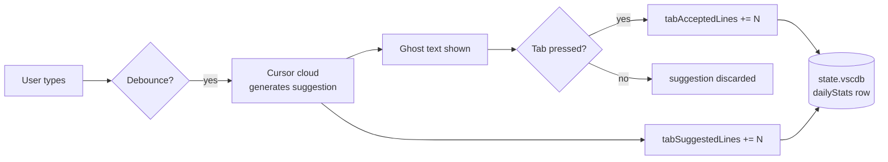
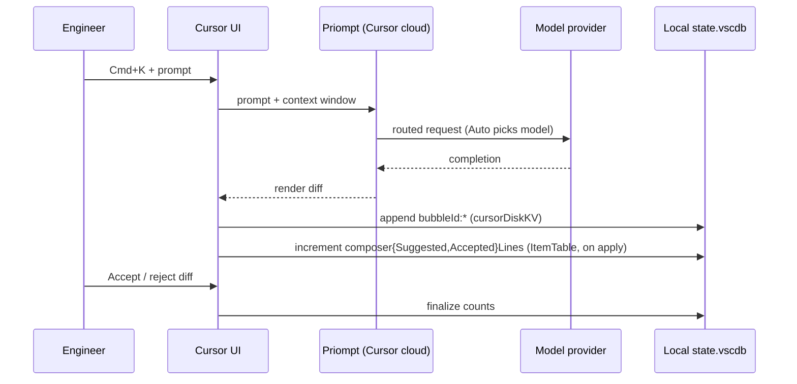
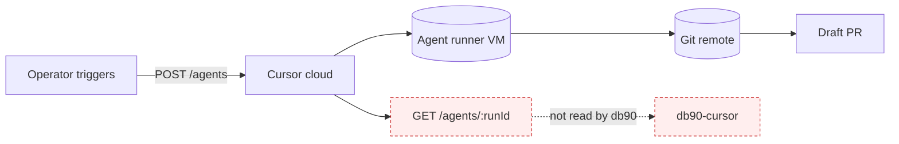
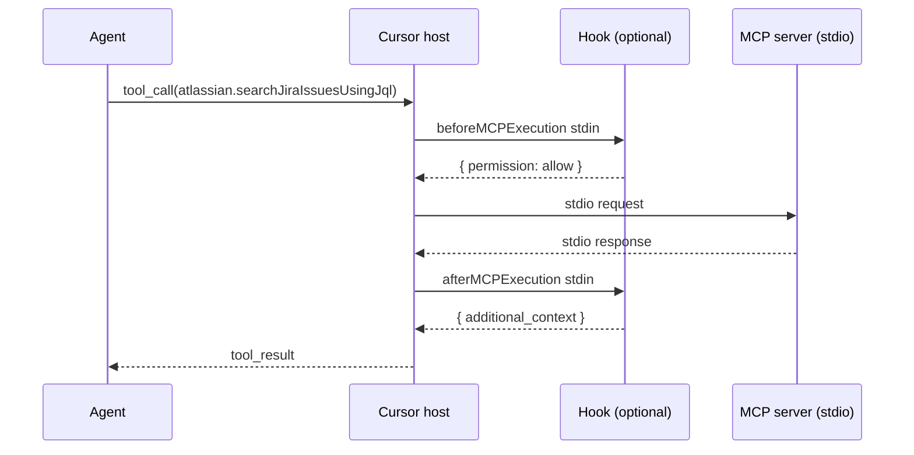
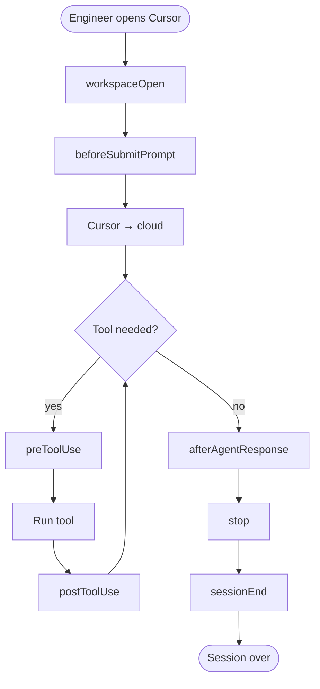
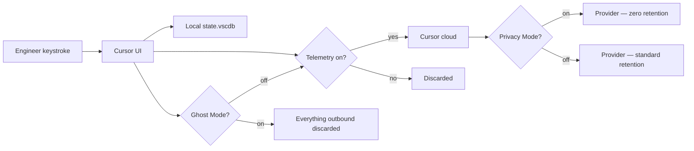
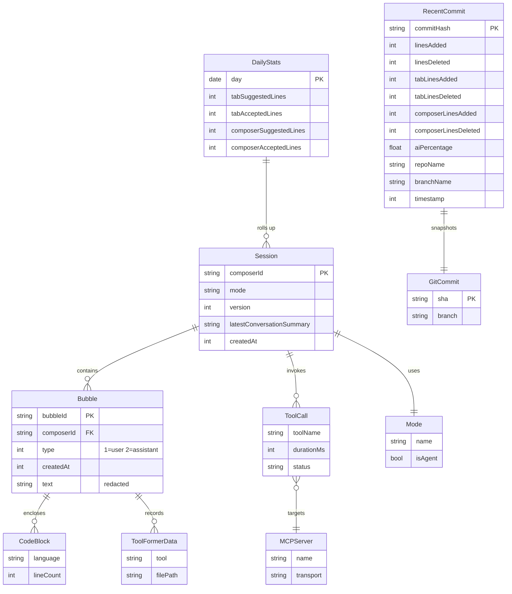

# DATA-CURSOR.md — Cursor vendor surface map

> **Audience:** db90 engineers extending the ingest path beyond the current `chat` + `completion` coverage. Companion to [`TOKENS.md`](TOKENS.md) (the May-2026 baseline) and [`DATA-CURRENT.md`](DATA-CURRENT.md) (the validated "what we capture today" view, produced by AIX-235).
> **Source ticket:** [AIX-233](AIX-233).
> **Research trail:** [`plans/available-data-cursor-claude-AIX-136/research/cursor-research-notes.md`](../../plans/available-data-cursor-claude-AIX-136/research/cursor-research-notes.md) — 13 WebSearch queries + 3 official-docs WebFetches, dated 2026-05-21.
>
> This document maps **what Cursor exposes about AI-assisted activity**, across every surface we identified, so the gap-analysis triage in AIX-235 can compare it against what the db90 CLI actually ingests.
>
> Documentation only. No source changes.

---

## 1. At-a-glance — baseline (May 2026)

Copied verbatim from the Cursor rows of [`TOKENS.md` §2](TOKENS.md). Status as of the epic-baseline branch.

| `event_type` | Cursor — feature | Cursor — capturing? |
|---|---|---|
| `completion` | Tab completion (inline autocomplete) | **Yes** |
| `chat` | Composer (Cmd+K / Cmd+I) + Chat panel | **Yes** |
| `edit` | Composer multi-file edits, Cmd+K inline edits | Captured but tagged as `chat` |
| `commit` | AI commit-message gen + `aiCodeTracking.recentCommit` row | **Yes** (`event_type: commit`, `metadata.source: recent_commit`) |
| `review` | BugBot (PR review) | **No** (not in local SQLite stores we read) |
| `test` | Composer-driven test gen | Lumped into `chat` |
| `debug` | Chat-driven debugging | Lumped into `chat` |
| `refactor` | Composer multi-file refactor | Lumped into `chat` |
| `documentation` | Chat-driven doc generation | Lumped into `chat` |
| `issue` | N/A | N/A |
| `comment` | N/A | N/A |
| `other` | catch-all | N/A |

**Headline:** 3 / 12 enum values populated (`completion`, `chat`, `commit` since AIX-235); rich vendor signal (per-language, per-tool, per-turn, agent-lifecycle, BugBot, MCP) exists either in cloud APIs or in undocumented local stores we don't read.

---

## 2. Vendor surface map — one section per Cursor domain

The diagram below frames how every domain that follows reaches db90.

```mermaid
flowchart LR
  subgraph Vendor [Cursor — vendor side]
    direction TB
    UI[Editor UI<br/>Tab / Cmd+K / Chat / Agent]
    Cloud[(Cursor cloud<br/>Priompt + model providers)]
    UI -- prompt + context --> Cloud
    Cloud -- completion --> UI
  end

  subgraph Local [Local on-disk surfaces]
    direction TB
    StateGlobal[(globalStorage/<br/>state.vscdb)]
    StateWS[(workspaceStorage/&lt;ws&gt;/<br/>state.vscdb + cursor.db)]
    AITrack[(~/.cursor/ai-tracking/<br/>ai-code-tracking.db)]
    Hooks[~/.cursor/hooks.json<br/>+ .cursor/hooks.json]
    Logs[~/.cursor/logs/<br/>+ MCP stderr capture]
  end

  subgraph CloudAPIs [Cursor cloud APIs]
    direction TB
    UsageAPI[/teams/filtered-usage-events]
    AnalyticsAPI[/analytics/ai-code/commits<br/>+ /changes]
    AdminAPI[/admin + /bugbot]
  end

  UI --> StateGlobal
  UI --> StateWS
  UI --> AITrack
  UI -. fires .-> Hooks
  UI -. stderr .-> Logs
  Cloud --> UsageAPI
  Cloud --> AnalyticsAPI
  Cloud --> AdminAPI

  subgraph DB90 [db90-cursor CLI]
    direction TB
    Reader[cursor-reader.ts]
    Mapper[mapper.ts]
    Sync[sync.ts → POST /ingest]
  end

  StateGlobal --> Reader
  StateWS --> Reader
  Reader --> Mapper --> Sync
  Sync --> API[(DB90 Rails<br/>tool_events hypertable)]

  classDef notRead fill:#fee,stroke:#c33,stroke-dasharray: 4 3;
  class AITrack,Hooks,Logs,UsageAPI,AnalyticsAPI,AdminAPI notRead;
```

Red dashed boxes are surfaces Cursor exposes that the current `db90-cursor` does **not** read.

---

### 2.1 Tab completion (inline autocomplete)

The most-fired surface. Triggers as you type; suggestion shown as ghosted text; accepted by `Tab`.

| Aspect | Value |
|---|---|
| **Source** | `~/Library/Application Support/Cursor/User/globalStorage/state.vscdb` → table `ItemTable` → keys `aiCodeTracking.dailyStats.v1.5.<YYYY-MM-DD>` (one row per day). Also mirrored per-workspace in `workspaceStorage/<ws-hash>/state.vscdb`. |
| **Cadence** | Daily aggregate, written by Cursor on every accepted/rejected tab suggestion; rolled into the day's row. No per-suggestion record in `dailyStats` (per-suggestion data may exist in `~/.cursor/ai-tracking/ai-code-tracking.db` — see §6). |
| **Granularity knobs** | (a) **Ghost Mode** kills outbound telemetry but keeps writing the local row. (b) Cursor `Settings → Features → Tab` toggles enable/disable + per-language. (c) `cursor.tabCompletion.delay` controls debounce → indirectly reduces volume. (d) Privacy Mode does not affect this row's existence. |
| **Fields read by db90-cursor today** | `tabSuggestedLines: number` (lines offered) → emitted as `tokens_in`; `tabAcceptedLines: number` (lines kept) → emitted as `tokens_out`. See `packages/tools/db90-cursor/src/mapper.ts:177-191`. |
| **Fields present but unread** | Per-language breakdown (cloud only via Analytics API); per-suggestion latency; rejection reason. None exist in `dailyStats` rows. |
| **JSON payload example** (anonymized) | See below. |

```json
// Cursor key: aiCodeTracking.dailyStats.v1.5.2026-05-20
{
  "tabSuggestedLines": 412,
  "tabAcceptedLines": 73,
  "composerSuggestedLines": 188,
  "composerAcceptedLines": 142,
  "date": "2026-05-20"
}
```



The model name is **not** present in `dailyStats` rows. The db90 mapper emits `model: "unknown"` for tab completions (`mapper.ts:138`).

---

### 2.2 Composer (Cmd+K / Cmd+I)

Multi-turn, multi-file edit surface. The same Cmd+K can target inline (selection) or multi-file (no selection).

| Aspect | Value |
|---|---|
| **Source** | Two stores: (a) `aiCodeTracking.dailyStats.v1.5.<date>` → `composerSuggestedLines` / `composerAcceptedLines` (aggregate). (b) `cursorDiskKV` table inside global `state.vscdb` → per-session blobs keyed `composerData:<composerId>` and `bubbleId:<composerId>:<bubbleId>` (per-turn). |
| **Cadence** | Daily aggregate (a); per-turn (b). (b) is **never read** by the current CLI. |
| **Granularity knobs** | Custom modes (Settings → Features → Chat → Custom modes) gate which tools are exposed per mode. `.cursor/rules/*.mdc` files scope project rules. Ghost Mode kills telemetry; local rows still written. Auto-mode obscures the resolved model. |
| **Fields read by db90-cursor today** | `composerSuggestedLines` → `tokens_in`; `composerAcceptedLines` → `tokens_out`. Emitted as `event_type: "chat"`. See `mapper.ts:193-200`. |
| **Fields present but unread** | Per-turn `text`, `codeBlocks`, `toolFormerData`, `thinking` blocks (in `bubbleId:*` rows); `latestConversationSummary` (in `composerData:*` rows); composer mode (agent / ask / manual / custom); resolved model identity. |
| **JSON payload example** (anonymized) | See below. |

```json
// Cursor key: composerData:cmp_abc123def (in cursorDiskKV) — simplified reference
{
  "composerId": "cmp_abc123def",
  "version": 3,
  "createdAt": 1716195600000,
  "latestConversationSummary": "Refactor pricing config validation to clamp negatives at the math layer.",
  "mode": "agent",
  "ruleCount": 2
}
```

```json
// Cursor key: bubbleId:cmp_abc123def:bub_xyz789 (in cursorDiskKV) — simplified reference
{
  "bubbleId": "bub_xyz789",
  "composerId": "cmp_abc123def",
  "type": 2,
  "createdAt": 1716195612345,
  "text": "[REDACTED — out of scope per epic decision]",
  "codeBlocks": [ { "language": "ts", "lineCount": 14 } ],
  "toolFormerData": [ { "tool": "edit_file", "filePath": "src/mapper.ts" } ],
  "thinking": null
}
```

**Observed on disk (May 2026, CUR-V12 — `npm run spotcheck:disk-kv`):** current builds use larger blobs than the examples above. Typical composer rows expose `_v` (e.g. `16`), `unifiedMode` (e.g. `"agent"`), `isAgentic`, `agentBackend`, epoch-ms `createdAt` / `lastUpdatedAt`, and many UI/state fields. Bubble rows often omit `composerId` in the JSON (it is in the key prefix), use ISO-8601 `createdAt` strings, and store `toolFormerData` as a **single object** (tool enum + `name` like `run_terminal_command_v2`) rather than the array shape in the simplified example. Any `cursor-5` parser must target observed fields, not the minimal JSON above.



---

### 2.3 Chat panel

The persistent right-side conversation. Same model backend as Composer; different UX (no inline diff stage, threaded). Treated identically by `dailyStats` — both increment `composer*Lines` when the chat applies an edit.

| Aspect | Value |
|---|---|
| **Source** | `cursorDiskKV` `composerData:*` + `bubbleId:*` (chat panel uses the same store as Composer in current versions). |
| **Cadence** | Per-turn write to `cursorDiskKV`; daily rollup into `dailyStats` only when the assistant's reply applies a code change. |
| **Granularity knobs** | `Chat → Pin model` overrides Auto; `@Codebase`, `@Docs`, `@Web`, `@Past Chats` change context payload size (and cost). |
| **Fields read by db90-cursor today** | Inherited from §2.2 (`composer*Lines`). |
| **Fields present but unread** | Same as §2.2 — plus thread title, message role, attached file refs. |
| **JSON payload example** | Same shape as §2.2 (`bubbleId:*`). |

The distinction between Chat panel and Composer is irrelevant to the current db90 ingest — both end up in `composer*Lines`.

---

### 2.4 Background agents (cloud)

Long-running agents that run on Cursor's infrastructure (not the user's laptop), draft branches, raise PRs.

| Aspect | Value |
|---|---|
| **Source** | **Cloud only.** No local SQLite trace. Surface = `cursor.com/docs/background-agent/api/overview`. |
| **Cadence** | Triggered on demand (Ctrl+Shift+B / ⌘B) or via REST POST. Long-lived (minutes to hours). |
| **Granularity knobs** | Workspace-admin settings: default model, default repo, base branch, user allow-list. Per-run: prompt + repository + optional `environment.json` (reproducible dev env). |
| **Fields read by db90-cursor today** | **None.** Out of scope for the local extractor. |
| **Fields available via the cloud API** | `runId`, `model`, `status`, `createdAt`, `prompt` (initial), branch + PR link, per-step tool invocations. |
| **JSON payload example** (Cloud Agents API response, anonymized) | See below. |

```json
{
  "runId": "run_demo_001",
  "status": "completed",
  "model": "claude-sonnet-4.7",
  "repository": "git@example.com:acme/demo.git",
  "baseBranch": "develop",
  "headBranch": "agent/run_demo_001",
  "pullRequestUrl": "https://github.com/acme/demo/pull/0",
  "createdAt": "2026-05-20T14:22:00Z",
  "durationMs": 482000,
  "steps": 14
}
```



---

### 2.5 BugBot (PR review)

Event-driven autonomous reviewer on Cursor's cloud. Triggers on PR creation. Now ships with Autofix that can open a Cloud Agent to apply suggested fixes.

| Aspect | Value |
|---|---|
| **Source** | **Cloud only.** Configured via `.cursor/BUGBOT.md` (per-repo rules in natural language) + BugBot dashboard. Admin API: `/bugbot/repo/update`, `/bugbot/repos`, `/bugbot/user/update`. |
| **Cadence** | Per-PR-open event; per-PR-update on subsequent pushes (if configured). Rate-limit: 60 req/min/team. |
| **Granularity knobs** | Effort level: **Default**, **High**, **Custom** (per-repo, set in dashboard). Per-repo BUGBOT.md rules in natural language (e.g. "use High effort for PRs touching auth or billing"). |
| **Fields read by db90-cursor today** | **None.** Local store has no review trace. |
| **Fields available via the admin API** | Repo enrollment status, per-user opt-in, review history (cloud-side). |
| **JSON payload example** (admin API, anonymized) | See below. |

```json
// POST /bugbot/repo/update response
{
  "repo": "acme/demo",
  "enrolled": true,
  "effort": "high",
  "rulesFile": ".cursor/BUGBOT.md",
  "lastReviewAt": "2026-05-20T11:08:00Z",
  "reviewsThisMonth": 47
}
```

---

### 2.6 MCP (Cursor as MCP host)

Cursor speaks Model Context Protocol over stdio. Each MCP server registered in `~/.cursor/mcp.json` or `.cursor/mcp.json` becomes a tool surface to the agent.

| Aspect | Value |
|---|---|
| **Source** | (a) Hook events `beforeMCPExecution` / `afterMCPExecution` (richest). (b) MCP server `stderr` — Cursor captures it but doesn't surface it back to the user (see `CursorMCPMonitor` community project). (c) Trace of which MCP tools an agent called appears inside `bubbleId:*` `toolFormerData`. |
| **Cadence** | Per tool invocation (real time). |
| **Granularity knobs** | Each MCP server has its own config (env, args). MCP servers themselves can throttle by responding with stderr-level messages (`logging/setLevel`). Cursor's host respects RFC 5424 severity. |
| **Fields read by db90-cursor today** | **None.** No code path opens hook output or `cursorDiskKV` `toolFormerData`. |
| **Fields available via hooks** (key ones) | `tool_name`, `tool_input`, `url` or `command`, `result_json`, `duration` (ms), shared `conversation_id` / `generation_id` / `model`. |
| **JSON payload example** (hook stdin for `afterMCPExecution`, anonymized) | See below. |

```json
{
  "hook_event_name": "afterMCPExecution",
  "conversation_id": "cmp_abc123def",
  "generation_id": "gen_001",
  "model": "claude-sonnet-4.7",
  "tool_name": "atlassian.searchJiraIssuesUsingJql",
  "tool_input": { "jql": "project = DEMO AND status = Open" },
  "result_json": { "issues": 12 },
  "duration": 842,
  "workspace_roots": ["/Users/user_demo/repos/acme/demo"],
  "user_email": "user_demo@example.com",
  "cursor_version": "1.7.4"
}
```



---

### 2.7 Inline edits

Cmd+K with a selection invokes the inline-edit code path. UI-distinct from Composer (single-step, diff applied in place). `dailyStats` does **not** separate inline edits from Composer multi-file edits — both increment `composer*Lines`.

| Aspect | Value |
|---|---|
| **Source** | (a) Aggregate via `composer*Lines` in `dailyStats` (current ingest). (b) Per-turn `bubbleId:*` with `toolFormerData[].tool = "edit_file"` (unread). (c) Hooks: `preToolUse` / `postToolUse` with `tool_name = "edit_file"` (unread). |
| **Cadence** | Per Cmd+K invocation. Daily rollup like Composer. |
| **Granularity knobs** | Custom mode disables/enables `edit_file` tool; `.cursor/rules/*` can constrain edit targets. |
| **Fields read by db90-cursor today** | Inherited from §2.2 (aggregate `composer*Lines`). Not distinguishable from multi-file Composer edits. |
| **Fields present but unread** | File path, edit ranges, language, whether the edit was accepted or rejected. |

The AIX-235 triage will note this as a candidate for a future `edit`-typed event once per-turn parsing lands.

---

### 2.8 AI commit messages

Cursor generates commit messages via the sparkle icon (source-control panel) or `Cmd+K → "git commit message"` in terminal. The completed commit then populates `aiCodeTracking.recentCommit`.

| Aspect | Value |
|---|---|
| **Source** | `state.vscdb` `ItemTable.aiCodeTracking.recentCommit` (one literal key, overwritten on each commit). |
| **Cadence** | One write per commit. The row's `timestamp` is the wall-clock commit time. |
| **Granularity knobs** | Sparkle-icon generation uses staged diff + commit history as context. The commit row is written **regardless** of who wrote the message (AI or human) — `aiPercentage` is the signal that distinguishes them. |
| **Fields read by db90-cursor today** | `linesAdded`, `linesDeleted`, `tabLinesAdded`, `tabLinesDeleted`, `composerLinesAdded`, `composerLinesDeleted` → composed into `tokens_in` (added) / `tokens_out` (deleted). `commitHash`, `commitMessage`, `repoName`, `branchName`, `aiPercentage` → metadata. See `mapper.ts:228-283`. |
| **Fields present but unread** | `nonAiLinesAdded/Deleted` (visible in the cloud Analytics API, may not be in the local row — needs spot-check). Per-file blame is cloud-only. |
| **JSON payload example** (local `aiCodeTracking.recentCommit`, anonymized) | See below. |

```json
{
  "commitHash": "abc123def456",
  "commitMessage": "Refactor pricing config validation",
  "repoName": "acme/demo",
  "branchName": "feature/refactor-pricing",
  "timestamp": 1716195800000,
  "linesAdded": 84,
  "linesDeleted": 31,
  "tabLinesAdded": 12,
  "tabLinesDeleted": 4,
  "composerLinesAdded": 65,
  "composerLinesDeleted": 22,
  "aiPercentage": 78.5
}
```

**Ingest status (AIX-235):** `mapRecentCommit` emits `event_type: "commit"` with `metadata.source: "recent_commit"`. Wired in `sync.ts` and `@db90/telemetry-mcp` with a separate `lastRecentCommitAt` watermark. **CUR-V04:** when `--project-id` / config are unset, `enrichCommitProjectAttribution` (`@db90/sdk`) resolves `project_id` from `metadata.repo_name` via `GET /projects/lookup` (GitHub `owner/repo` slug → HTTPS/SSH remotes).

---

### 2.9 Per-language stats

Cursor's cloud dashboard publishes per-language breakdowns. The on-device `dailyStats.v1.5.<date>` rows are **language-agnostic** — line counts are flat, not split by language.

| Aspect | Value |
|---|---|
| **Source** | Cloud only. Analytics API exposes file-level metadata (`fileName`, `fileExtension`) per accepted AI change via `/analytics/ai-code/changes`. |
| **Cadence** | Real-time on cloud; aggregated daily in dashboard. |
| **Granularity knobs** | Privacy mode redacts `fileName` and `fileExtension`. Enterprise plan only for the API. |
| **Fields read by db90-cursor today** | **None.** |
| **Fields available via Analytics API** | `metadata[].fileName`, `metadata[].fileExtension`, per-file line counts. |
| **JSON payload example** (Analytics API response excerpt, anonymized) | See below. |

```json
{
  "changeId": "chg_001_demo",
  "userEmail": "user_demo@example.com",
  "source": "COMPOSER",
  "model": "claude-sonnet-4.7",
  "totalLinesAdded": 84,
  "totalLinesDeleted": 31,
  "metadata": [
    { "fileName": "src/mapper.ts", "fileExtension": "ts", "linesAdded": 60, "linesDeleted": 22 },
    { "fileName": "src/sync.ts",   "fileExtension": "ts", "linesAdded": 24, "linesDeleted": 9 }
  ]
}
```

---

### 2.10 Custom modes

Beta. Custom modes let users compose named bundles of (icon, shortcut, enabled tools, custom instructions). Settings → Features → Chat → Custom modes.

| Aspect | Value |
|---|---|
| **Source** | Local. Mode definitions live in user settings (Cursor's `Settings/sync` JSON, location varies by OS). Mode **selection per session** lands in `composerData:*` (`mode` field). |
| **Cadence** | One value per session. |
| **Granularity knobs** | Per-mode tool allow-list. A future `.cursor/modes.json` project-level file has been discussed but not shipped at time of writing. |
| **Fields read by db90-cursor today** | **None.** Mode info is in `cursorDiskKV` (unread). |
| **Fields present but unread** | Mode name, enabled tools, custom instructions, mode invocation count. |

---

### 2.11 Hooks (Cursor 1.7+)

The single biggest unmonitored surface. 20+ lifecycle events; each hook is a child process that receives JSON over stdin, returns JSON over stdout.

| Aspect | Value |
|---|---|
| **Source** | Config: `~/.cursor/hooks.json` (user) and/or `.cursor/hooks.json` (project). Runtime: Cursor invokes the configured executable on each event. |
| **Cadence** | Real time, per event. Many fire dozens of times per session. |
| **Granularity knobs** | Per-event opt-in (declare only the events you want). Hook can return `permission: "allow" | "deny" | "ask"` to gate execution. |
| **Common input fields** (every hook) | `conversation_id`, `generation_id`, `model`, `hook_event_name`, `cursor_version`, `workspace_roots`, `user_email`, `transcript_path`. |
| **Lifecycle events that would emit db90-relevant signal** (selected) | `sessionStart`, `sessionEnd` (session boundaries + reason); `preToolUse` / `postToolUse` (every tool call); `beforeShellExecution` / `afterShellExecution` (shell commands incl. `git commit`); `beforeMCPExecution` / `afterMCPExecution` (MCP traffic — see §2.6); `afterFileEdit` (file edits); `beforeSubmitPrompt` (every prompt **before** redaction — out of scope per epic); `afterAgentResponse` (response text — out of scope); `afterAgentThought` (extended-thinking blocks); `subagentStart` / `subagentStop` (Task tool dispatch); `preCompact` (context-window compaction); `stop` (loop ends). |
| **Fields read by db90-cursor today** | **None** for ingest. CUR-V13 ships `install:hooks-feasibility` / `verify:hooks-feasibility` to log redacted hook stdin to `~/.cursor/db90-hooks-feasibility.ndjson` (verification only). |
| **JSON payload example** (`sessionEnd` hook stdin, anonymized) | See below. |

```json
{
  "hook_event_name": "sessionEnd",
  "session_id": "sess_001_demo",
  "conversation_id": "cmp_abc123def",
  "reason": "completed",
  "duration_ms": 482000,
  "final_status": "ok",
  "model": "claude-sonnet-4.7",
  "cursor_version": "1.7.4",
  "workspace_roots": ["/Users/user_demo/repos/acme/demo"],
  "user_email": "user_demo@example.com"
}
```



Hooks are also where db90 could finally see the **resolved** model name (the `model` field in hook input is populated post-routing), closing the Auto-mode opacity gap noted in §6.

---

### 2.12 Settings / telemetry knobs

Three orthogonal switches govern outbound data. The local SQLite rows are written regardless of all of them (until Ghost Mode).

| Switch | Location | Effect |
|---|---|---|
| **Privacy Mode** | Settings → General → Privacy Mode | Zero data retention with model providers. Code not used for training. Local `state.vscdb` rows still populated. |
| **Telemetry** | Settings → Telemetry | Crash reports + feature analytics opt-out. Orthogonal to Privacy Mode. |
| **Ghost Mode** | Settings → Advanced → Local / Ghost Mode | Kill switch. Every chat / snippet / agent diff / telemetry ping intercepted locally and discarded. `state.vscdb` rows still populate (db90-cursor still works in Ghost Mode — relevant compliance angle). |
| **Early Access** | Settings → Beta → Update frequency | Opt into experimental builds. Schema break risk is highest here. |
| **`.cursor/rules/*.mdc`** | Repo root | Per-glob scoped rules; affect prompt content, not telemetry. |



---

## 3. Relationships & derivations

### 3.1 Lines vs tokens vs cost

Cursor speaks **lines**; db90 speaks **tokens** and **dollars**. The mapper bridges them.

| Layer | Unit | Source |
|---|---|---|
| Tab / Composer suggestion | Lines | `tabSuggestedLines` / `composerSuggestedLines` |
| Acceptance | Lines | `tabAcceptedLines` / `composerAcceptedLines` |
| db90 `tokens_in` | Lines (mislabeled; see TOKENS §4) | mirrors suggested |
| db90 `tokens_out` | Lines (mislabeled) | mirrors accepted |
| db90 `cost_usd` | $ | `lines × tokens_per_line × rate / 1_000_000` (see `mapper.ts:86-96`) |

Defaults (`mapper.ts:12-17`):

```text
tokens_per_line               = 15
completion_output_per_mtok    = 0.60
chat_input_per_mtok           = 3.00
chat_output_per_mtok          = 15.00
```

Cost formula for tab completion: `lines × 15 × 0.60 / 1_000_000`.
Cost formula for composer / chat / commit: `lines × 15 × (15.00 + 3.00 × 2) / 1_000_000 = lines × 15 × 21.00 / 1_000_000`.

Per-driver overrides live in `~/.db90-cursor/config.json` → `pricing`.

### 3.2 Lines accepted vs suggested → AI percentage

`recentCommit.aiPercentage` is computed by Cursor **on-device** via signature matching: every AI-suggested line gets a local signature; the post-commit diff is checked against the signature index. The number reaches the local row alongside `linesAdded` / `linesDeleted`. This is the only first-class AI-attribution metric in the local store.

### 3.3 Model attribution

The model name in the local store is non-trivial:
- `dailyStats.v1.5.<date>` rows: **no model field.** Mapper emits `"unknown"`.
- `recentCommit`: **no model field.** Mapper emits `"unknown"`.
- Legacy `cursor.db` `CursorRequestFeedback.model`: present (used by `mapper.ts:294`).
- Model-keyed `dailyStats` fallback (shape-discovery at `mapper.ts:204-219`): `{ "claude-3-5-sonnet": { inputTokens, outputTokens } }` — supports per-model rows when Cursor ships that layout in a future minor version.
- Hooks input: `model` field present in every hook (would resolve Auto-mode).



### 3.4 Per-model cost (when model-keyed rows appear)

When Cursor ships a future `dailyStats` layout that keys totals by model, `mapper.ts:204-219` opens a fallback path that emits **one event per model** instead of one event per day. This is half-implemented today; the trigger condition is "the daily rollup row has no `tab*` / `composer*` fields **and** has at least one nested object with an `inputTokens` / `outputTokens` pair." Useful for a future per-model cost breakdown when the upstream layout changes.

### 3.5 Outbound payload reference (every field db90-cursor emits today)

The mapper produces a `Db90Payload` object (`packages/tools/db90-cursor/src/mapper.ts:45-55`). All fields below cross-reference §2 domains.

**Top-level payload fields:**

| Field | Type | Source | Notes |
|---|---|---|---|
| `tool_name` | `"cursor"` literal | constant | identifies the CLI to Rails |
| `event_type` | `"completion" \| "chat" \| "commit"` | `mapper.ts:140,195,260,297,302` | three enum values populated; Path B (`recentCommit`) emits `commit` |
| `model` | string | `dailyStats` mapper emits `"unknown"`; legacy `cursor.db` row emits `CursorRow.model`; model-keyed fallback emits the key (e.g. `"claude-3-5-sonnet"`) | Auto-mode resolved name not present locally |
| `tokens_in` | number (lines or tokens) | `tab*Suggested` / `composer*Suggested` / `linesAdded+tabLinesAdded+composerLinesAdded` / legacy `promptTokens` | mislabeled as tokens — see §3.1 |
| `tokens_out` | number (lines or tokens) | `tab*Accepted` / `composer*Accepted` / `linesDeleted+...` / legacy `generatedTokens` | same |
| `cost_usd` | number | computed via `computeLineCost` or `computeTokenCost` | see §3.1 formula |
| `occurred_at` | ISO-8601 string | `dailyStats`: `<date>T00:00:00.000Z`; `recentCommit`: `toIsoString(timestamp)`; legacy: `toIsoString(row.timestamp)` | day-precision for daily rollups |
| `project_id` | string (optional) | resolved by `project-resolver.ts` from workspace path | omitted when no project match |

**Metadata fields** (`Db90PayloadMetadata`, `mapper.ts:30-43`):

| Field | Type | Source | Notes |
|---|---|---|---|
| `cursor_session_id` | string \| null | legacy `CursorRow.sessionId ?? CursorRow.requestId`; null for daily / commit | daily/commit have no session id |
| `workspace` | string | DB file path (per-workspace `.../workspaceStorage/<hash>/state.vscdb` or global `state.vscdb`) | stable store identifier; not the opened folder path |
| `workspace_scope` | `"global" \| "workspace"` | `workspace-metadata.ts` from `dbPath` | `global` for install-wide rollups |
| `workspace_folder` | string (optional) | `workspace.json` in the hash directory when present | human project path (`file://` URI decoded) |
| `cost_model` | `"estimated_line_count"` \| `"token_count"` | line paths vs legacy `cursor.db` (`mapper.ts`) | `token_count` when `cursor_session_id` set (Path C) |
| `scannable` | `false` literal | constant | mapper never sets `true` |
| `risk_level` | `"none"` literal | constant | mapper never sets risk |
| `source` | `"recent_commit"` (optional) | only set for the `recentCommit` mapper | absent for daily / legacy |
| `commit_hash` | string (optional) | `recentCommit.commitHash` | recent-commit only |
| `commit_message` | string (optional) | `recentCommit.commitMessage` | recent-commit only |
| `repo_name` | string (optional) | `recentCommit.repoName` | recent-commit only |
| `branch_name` | string (optional) | `recentCommit.branchName` | recent-commit only |
| `ai_percentage` | number (optional) | `recentCommit.aiPercentage` (coerced from number-or-string) | recent-commit only |

**Local SQLite row fields the mapper reads** (`CursorRow`, legacy `cursor.db`):

| Field | Type | Notes |
|---|---|---|
| `requestId` | string \| null | legacy per-request id (used as fallback session id) |
| `timestamp` | number \| string \| null | seconds **or** ms; normalized by `toEpochMs` |
| `model` | string \| null | the model name as Cursor recorded it for this request |
| `promptTokens` | number \| null | real prompt tokens — emitted as `tokens_in` |
| `generatedTokens` | number \| null | real generated tokens — emitted as `tokens_out` |
| `type` | number \| null | `1` → `chat`; anything else → `completion` |
| `sessionId` | string \| null | preferred for `cursor_session_id` metadata |

---

## 4. Granularity matrix

| Domain | Knob | Default | Dial up | Dial down |
|---|---|---|---|---|
| Tab completion | `Settings → Features → Tab` | On | Per-language opt-in | Off → no `tab*Lines` rows |
| Tab completion | `cursor.tabCompletion.delay` (ms) | ~75ms | Lower delay → more suggestions | Higher delay → fewer rows |
| Composer / Chat | Custom modes (Settings → Features → Chat) | Built-in modes | Define custom mode with broader tool access | Restrict tools per mode |
| Composer / Chat | `.cursor/rules/*.mdc` | None | Add file globs with stricter rules | Remove rules |
| Composer / Chat | Pinned model | Auto | Pin a specific model (visible in hook `model`) | Use Auto (model opaque to local) |
| Background agents | Default model / repo / base branch | Workspace-admin set | Allow more starters via allow-list | Restrict starters |
| BugBot | Effort level | Default | High / Custom | Disable repo enrollment |
| MCP | `~/.cursor/mcp.json` server count | 0 | Add servers (each adds hook surface) | Remove servers |
| Hooks | `~/.cursor/hooks.json` event subscription | None | Subscribe to more events (richer signal) | Subscribe to fewer / drop hook |
| Telemetry | `Settings → Telemetry` | On | n/a | Off — local DBs unchanged |
| Privacy Mode | `Settings → General → Privacy Mode` | Off (Free/Pro) | n/a | On — zero retention upstream |
| Ghost Mode | `Settings → Advanced → Local / Ghost Mode` | Off | n/a | On — kills all outbound; local DBs still populate |
| Early Access | `Settings → Beta → Update frequency` | Standard | Early Access → unstable schema | Standard — stable |
| db90 sampling | `~/.db90-cursor/config.json → pricing` + watermark | Defaults | Backfill (drop watermark file) | Smaller `tokens_per_line` rate |
| db90 emission | `dryRun` flag in `sync.ts` | false | n/a | true — no POST, console-only |

---

## 5. Hidden / undocumented findings

Every entry below is supported by the search trail in [`cursor-research-notes.md`](../../plans/available-data-cursor-claude-AIX-136/research/cursor-research-notes.md).

### 5.1 Separate `~/.cursor/ai-tracking/ai-code-tracking.db` SQLite store

Confirmed by community discovery during the `state.vscdb` schema query. This is a **second** SQLite database under the Cursor user directory, distinct from the workspaceStorage / globalStorage `state.vscdb` files the current `cursor-reader.ts` enumerates (`findStateVscDbs`, `findCursorDbs`). Schema not documented anywhere we could find. Hypothesis: per-suggestion / per-acceptance log that backs the AI Code Tracking API's on-device signature index. **Recommended next step:** open the DB read-only on a developer laptop and inspect tables.

### 5.2 Cursor Hooks 1.7+ — richest unmonitored surface

20+ lifecycle events, each emitting structured JSON with `conversation_id`, `generation_id`, `model`, `tool_name`, `duration_ms`, `cursor_version`, `workspace_roots`, `user_email`. The current CLI installs no hook executable. A db90-installed hook (or a doc nudging engineers to register one) would deliver **per-turn** signal that today's `dailyStats` row flattens into a daily count. The `model` field in hook input would also resolve the Auto-mode opacity gap (§5.4).

### 5.3 `cursorDiskKV` v3 schema — per-session granularity

Per-session data lives in `cursorDiskKV` under `composerData:<id>` (session metadata) + `bubbleId:<id>:<bub>` (per-turn). Schema version 3 is current; earlier versions inlined turns in `composerData.conversation[]`. Reading it would give per-turn `model`, `createdAt`, `codeBlocks`, `toolFormerData`, `thinking`. **Volatile.** Migrations 0 → 1 → 2 → 3 already happened; another is likely.

### 5.4 Auto-mode model opacity

When Cursor's "Auto" routing picks a model, the **resolved** model name is never written to `dailyStats` or `recentCommit`. The local mapper emits `"unknown"`. The only on-device surface that sees the resolved model is **hooks** (input field `model`).

### 5.5 Ghost Mode ≠ local-store off

Ghost Mode kills outbound telemetry but does **not** stop Cursor writing local rows. db90-cursor continues to function in Ghost Mode — relevant if an engineer enables Ghost Mode for upstream privacy but expects all telemetry to stop. This is a compliance / employee-trust angle worth surfacing internally.

### 5.6 `dailyStats` version prefixes (CUR-V11)

The reader selects `ItemTable` keys under `aiCodeTracking.%` whose names end in `YYYY-MM-DD`, so `v1.6.2026-06-01` is not dropped solely for the version segment. Risk shifts to **JSON shape**: if `v1.6` drops `tab*` / `composer*` fields, `mapDailyStats` may emit nothing until the mapper is updated. Inventory: `npm run audit:local-stores` in `db90-cursor` → `daily_stats_versions` in the JSON report.

---

## 6. Delta from baseline (`TOKENS.md`)

What this doc adds that the May-2026 PDF baseline did not cover:

- **Per-domain granularity:** TOKENS lists Cursor's emitted sources in a 4-row table; this doc breaks them out into 12 domain sections, each with cadence + granularity-knob + JSON example.
- **JSON payload examples:** TOKENS has none; every domain here ships one anonymized example.
- **Mermaid diagrams:** five total (vendor-overview flowchart, tab-completion lifecycle, Composer sequence, background-agent flow, MCP sequence, hooks lifecycle, telemetry-switches flow, ER diagram). TOKENS has none.
- **Hooks lifecycle catalog:** TOKENS does not mention Hooks at all (released after the PDF). Section 2.11 is fully new.
- **Cloud-API surface map:** TOKENS notes BugBot is cloud-only and out-of-reach; this doc enumerates the specific endpoints (`/teams/filtered-usage-events`, `/analytics/ai-code/commits`, `/analytics/ai-code/changes`, `/bugbot/repos`) with their fields.
- **`cursorDiskKV` v3 schema:** TOKENS §6 notes that `cursorDiskKV` is "~200K rows / undocumented"; this doc gives the actual key shapes (`composerData:<id>`, `bubbleId:<id>:<bub>`), the per-bubble fields, and the version history.
- **Hidden findings:** TOKENS lists "available signal" but does not separate documented from undocumented; this doc has a dedicated §5 with 6 findings backed by an audited search trail.
- **Granularity matrix:** TOKENS does not list dial-up / dial-down knobs; this doc has a 15-row matrix.

---

## 7. References (with retrieval dates)

All accessed 2026-05-21 unless noted.

### Cursor official docs
- AI Code Tracking API — https://cursor.com/docs/account/teams/ai-code-tracking-api
- Admin API — https://docs.cursor.com/account/teams/admin-api
- Analytics API — https://cursor.com/docs/account/teams/analytics-api
- Analytics dashboard — https://docs.cursor.com/account/teams/analytics
- Background Agents — https://docs.cursor.com/en/background-agent
- Cloud Agents API — https://cursor.com/docs/background-agent/api/overview
- BugBot — https://cursor.com/docs/bugbot
- BugBot landing — https://cursor.com/bugbot
- Bugbot Autofix announcement — https://cursor.com/blog/bugbot-autofix
- Custom Modes — https://docs.cursor.com/chat/custom-modes
- Hooks — https://cursor.com/docs/hooks
- AI commit message — https://docs.cursor.com/more/ai-commit-message
- Generate commit message — https://docs.cursor.com/features/generate-commit-message
- Reviewing code with Cursor — https://cursor.com/for/code-review
- MCP — https://cursor.com/docs/context/mcp
- CLI Configuration — https://cursor.com/docs/cli/reference/configuration
- Beta / Early Access — https://docs.cursor.com/settings/beta
- Data Use & Privacy — https://cursor.com/data-use
- Privacy Policy — https://cursor.com/privacy
- Changelog — https://cursor.com/changelog

### Community / reverse-engineering
- vibe-replay deep dive on `state.vscdb` — https://vibe-replay.com/blog/cursor-local-storage/
- `cursorDiskKV` v3 schema (S2thend/cursor-history) — https://zread.ai/S2thend/cursor-history/7-cursor-data-storage-model
- AI Code Tracking API forum thread — https://forum.cursor.com/t/details-on-ai-code-tracking-api/128253
- Auto mode coverage / FRs — https://forum.cursor.com/t/show-which-model-auto-mode-selected-after-each-response/151947
- Cursor v1.5 release thread — https://forum.cursor.com/t/cursor-v1-5-release-discussions/131103
- Cursor v1.6 release thread — https://forum.cursor.com/t/cursor-v1-6-release-discussions/133657
- Hooks deep-dive — https://blog.gitbutler.com/cursor-hooks-deep-dive
- Hooks announcement — https://www.infoq.com/news/2025/10/cursor-hooks/
- CursorMCPMonitor — https://github.com/willibrandon/CursorMCPMonitor
- Ghost Mode walkthrough — https://stevekinney.com/courses/ai-development/cursor-ghost-mode
- Roman's Cursor under the hood — https://roman.pt/posts/cursor-under-the-hood/

### Local cross-references (repo)
- `packages/tools/db90-cursor/src/cursor-reader.ts` (esp. the `v1.5` hardcode at line 170)
- `packages/tools/db90-cursor/src/mapper.ts` (esp. the line-cost model lines 86-96, the daily-stats mapper lines 164-222, the recent-commit mapper lines 228-283, the model-keyed fallback lines 204-219, the `event_type` tag at line 259)
- `packages/tools/db90-cursor/src/sync.ts` (orchestration; per-driver pricing lines 28-29)
- `docs/data-pipeline/TOKENS.md` — baseline this doc deepens
- `plans/available-data-cursor-claude-AIX-136/research/cursor-research-notes.md` — audit trail
